# Módulo B — Panel RRHH

**Perfil:** Gestor RRHH, Responsable CAE, Supervisor, Operario CAE, Super Administrador
**Acceso:** [https://creatorapp.zoho.com/formacion11/human-resource-management/](https://creatorapp.zoho.com/formacion11/human-resource-management/)
**Versión:** 1.3 — Julio 2026

---

## Índice

1. [Tablero RRHH](#1-tablero-rrhh)
2. [Gestión de Empleados](#2-gestión-de-empleados)
   - 2.1 [Listado de Empleados](#21-listado-de-empleados)
   - 2.2 [Listado Empleados (Salarios)](#22-listado-empleados-salarios)
   - 2.3 [Ficha Empleado](#23-ficha-empleado)
3. [Planificación](#3-planificación)
   - 3.1 [52 Semanas](#31-52-semanas)
   - 3.2 [Detalle de Semana](#32-detalle-de-semana)
4. [Asignaciones Técnico-Cliente](#4-asignaciones-técnico-cliente)
   - 4.1 [Asignación Técnico Cliente (Reporte)](#41-asignación-técnico-cliente-reporte)
   - 4.2 [Panel de Asignaciones](#42-panel-de-asignaciones)
5. [EPIs y Herramientas](#5-epis-y-herramientas)
6. [Solicitudes de Permisos](#6-solicitudes-de-permisos)
7. [Mensajes de Empleados](#7-mensajes-de-empleados)
   - 7.1 [Lista de Conversaciones](#71-lista-de-conversaciones)
   - 7.2 [Chat RRHH](#72-chat-rrhh)
8. [Dashboards y Analíticas](#8-dashboards-y-analíticas)
   - 8.1 [Semáforo Caducidades EPI](#81-semáforo-caducidades-epi)
   - 8.2 [Timeline de Permisos](#82-timeline-de-permisos)
9. [Formaciones](#9-formaciones)
10. [Configuración General](#10-configuración-general)
11. [Filtros en Reportes](#11-filtros-en-reportes)
    - 11.1 [Búsqueda y filtros rápidos](#111-búsqueda-y-filtros-rápidos)
    - 11.2 [Filtros personalizados predefinidos](#112-filtros-personalizados-predefinidos)
    - 11.3 [Crear filtros predefinidos (Administradores)](#113-crear-filtros-predefinidos-administradores)
12. [STOP2 — Control de Análisis Previos](#12-stop2--control-de-análisis-previos)
    - 12.1 [Reporte STOP2](#121-reporte-stop2)
    - 12.2 [Informe semanal automático a clientes](#122-informe-semanal-automático-a-clientes)

---

## 1. Tablero RRHH

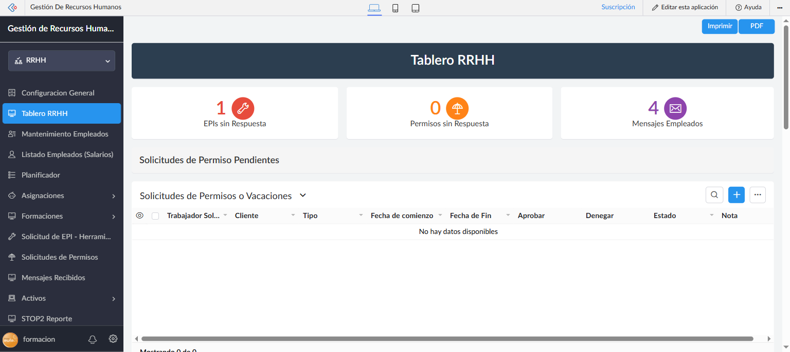

El **Tablero RRHH** es la pantalla de inicio del perfil de gestión. Centraliza los KPIs operativos más relevantes y permite acceder rápidamente a las secciones de mayor uso.

### KPIs superiores

| Indicador | Qué mide | Clic lleva a |
|-----------|----------|-------------|
| **EPIs Sin Respuesta** | Solicitudes de EPI pendientes de gestionar | Reporte de solicitudes EPI |
| **Solicitudes Permisos** | Permisos o vacaciones pendientes de respuesta | Tablero de solicitudes de permisos |
| **Mensajes Empleados** | Mensajes de empleados no leídos | Lista de conversaciones |

Los KPIs son clicables — al hacer clic navegas directamente a la sección correspondiente.

### Secciones embebidas

El tablero muestra embebido el **Panel de Documentación con Clientes** (`Clientes_Doc`): cards por cliente con estado de su documentación (documentos actualizados, caducados, pendientes de envío, validados). Cada card tiene un botón **"Ver Docs"** que abre el detalle de documentación de ese cliente.

> **Nota:** El tablero refleja el estado en tiempo real. Si un KPI muestra 0, significa que no hay pendientes en esa categoría.

---

## 2. Gestión de Empleados

### 2.1 Listado de Empleados

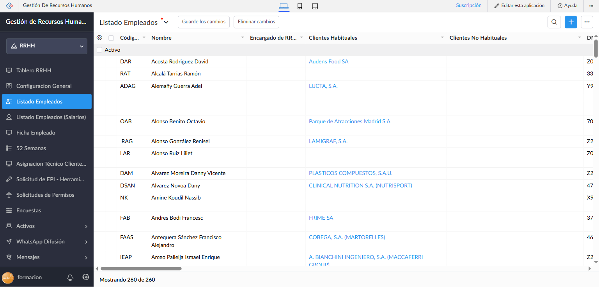

**Ruta de menú:** RRHH → Listado Empleados

El reporte **Employee Details** muestra todos los trabajadores registrados en el sistema, agrupados por estado (**Activo** / **Inactivo**).

**Columnas principales:**

| Columna | Descripción |
|---------|-------------|
| **Nombre** | Nombre completo del empleado |
| **Área Profesional** | Área o departamento (ej. CONSTRUCCIÓN, INFORMÁTICA) |
| **Email corporativo** | Email principal del trabajador |
| **Estado** | Activo / Inactivo |
| **Ficha** | Botón de acceso directo a la Ficha Empleado |

**Acciones disponibles:**
- **Búsqueda avanzada** — filtra por cualquier campo
- **Agregar** — crea un nuevo empleado
- **Exportar** — descarga el listado en Excel/CSV

> El sistema tiene actualmente más de 260 empleados registrados.

### 2.2 Listado Empleados (Salarios)

**Ruta de menú:** RRHH → Listado Empleados (Salarios)

Vista restringida del listado de empleados que incluye información salarial. Solo accesible para perfiles con permiso explícito (Super Administrador, Gestor RRHH con acceso a datos salariales).

### 2.3 Ficha Empleado

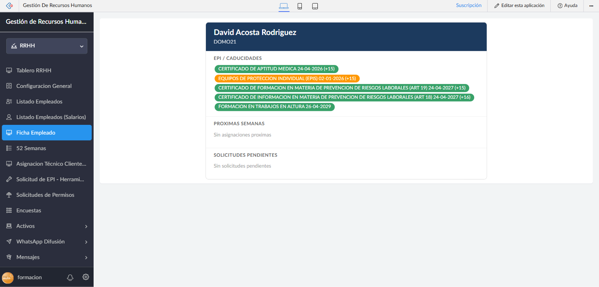

**Ruta de menú:** RRHH → Ficha Empleado
**URL directa:** `#Page:Ficha_Empleado?EmpNo={id_empleado}`

La **Ficha Empleado** es un panel resumen completo del trabajador, generado dinámicamente como HTML. Muestra toda la información relevante de un empleado en una sola vista.

**Secciones de la ficha:**

#### Header del empleado
- Nombre completo y empresa asignada
- Foto o iniciales en avatar de color

#### EPIs y Documentación
Tabla de pills con los EPIs y documentos del empleado, con colores según estado:

| Color | Estado |
|-------|--------|
| 🟢 Verde | Entregado / Actualizado |
| 🟠 Naranja | Aprobado / En gestión |
| 🔴 Rojo | Rechazado / Caducado |
| ⚫ Gris | Pendiente |

#### Próximas Semanas
Resumen de las asignaciones del técnico en las próximas semanas del calendario laboral.

#### Solicitudes Pendientes
Lista de solicitudes activas (permisos, EPIs) aún sin resolver.

**Cómo acceder a una ficha:**
1. Desde el **Listado de Empleados** → clic en el botón **"Ficha"** de la fila
2. Desde el **Panel de Asignaciones** → clic en el avatar del técnico
3. Desde **Chat RRHH** → botón **"Ver Ficha"** en el footer del chat

---

## 3. Planificación

### 3.1 52 Semanas

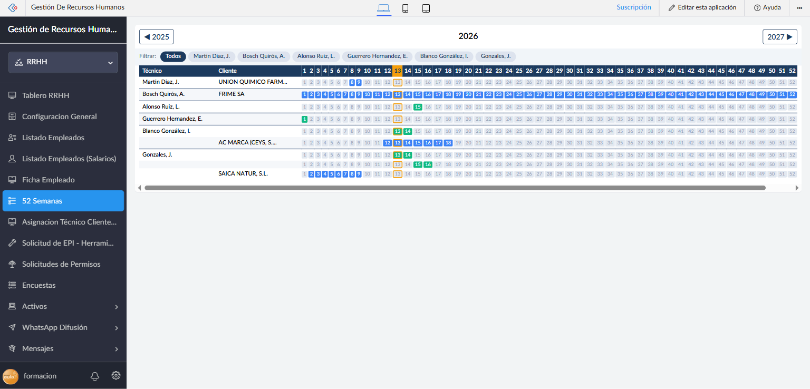

**Ruta de menú:** RRHH → 52 Semanas
**URL directa:** `#Page:Semanas_Nuevo`

El **Calendario de 52 Semanas** muestra la planificación laboral anual del personal en formato de cuadrícula, con una columna por semana y una fila por técnico.

**Características:**

| Elemento | Descripción |
|----------|-------------|
| **Selector de año** | Cambia el año visualizado (por defecto: año actual) |
| **Filtro por técnico** | Muestra solo las filas del técnico seleccionado |
| **Celdas de semana** | Muestra el tipo de asignación con color (M=Mañana, T=Tarde, N=Noche) |
| **Tooltips** | Al pasar el ratón por una celda, muestra el rango de fechas de la semana y el tipo de turno |

**Interacción:**
- Clic en cualquier celda → navega al **Detalle de Semana** para esa semana/año específicos

**Cliente no disponible:**
Si el cliente tiene registrados días de cierre (vacaciones de planta, paradas técnicas, etc.), las semanas afectadas se marcan con un borde discontinuo sobre la celda, indicando que el técnico queda libre esos días. Estos periodos se gestionan desde el registro del cliente — ver [C §3 — Días de cierre del cliente](C-prl-cae.md#3-clientes).

### 3.2 Detalle de Semana

**URL directa:** `#Page:Detalle_Semana?Anio={año}&Semana={número_semana}`

Vista detallada de una semana específica. Muestra una tabla con:

| Columna | Descripción |
|---------|-------------|
| **Técnico** | Nombre del trabajador |
| **Cliente** | Cliente al que está asignado |
| **Lun – Dom** | Badges de turno para cada día de la semana (M/T/N/?) |

Los badges de turno tienen tooltip con el horario exacto al pasar el ratón.

---

## 4. Asignaciones Técnico-Cliente

### 4.1 Asignación Técnico Cliente (Reporte)

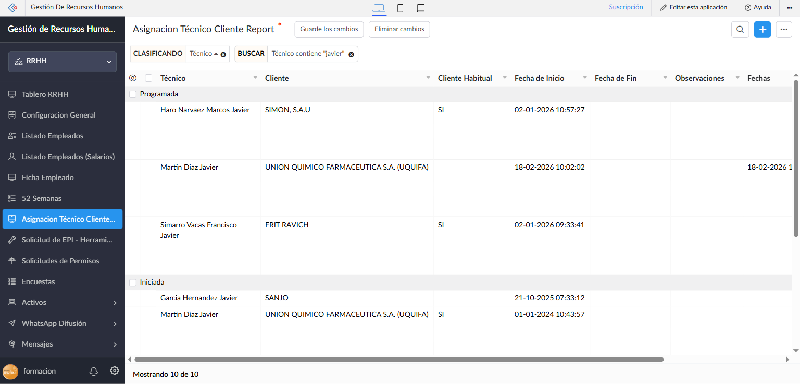

**Ruta de menú:** RRHH → Asignación Técnico Cliente
**URL directa:** `#Report:Asignacion_T_cnico_Cliente_Report`

Reporte tabular de todas las asignaciones técnico-cliente del sistema. Muestra el estado actual de cada asignación (Activa / Finalizada) y permite gestionar altas y bajas.

**Acciones:**
- **Agregar nueva asignación** — botón para asignar un técnico a un cliente
- **Editar** — modifica una asignación existente
- **Ver historial** — consulta el historial de un técnico o cliente

### 4.2 Panel de Asignaciones

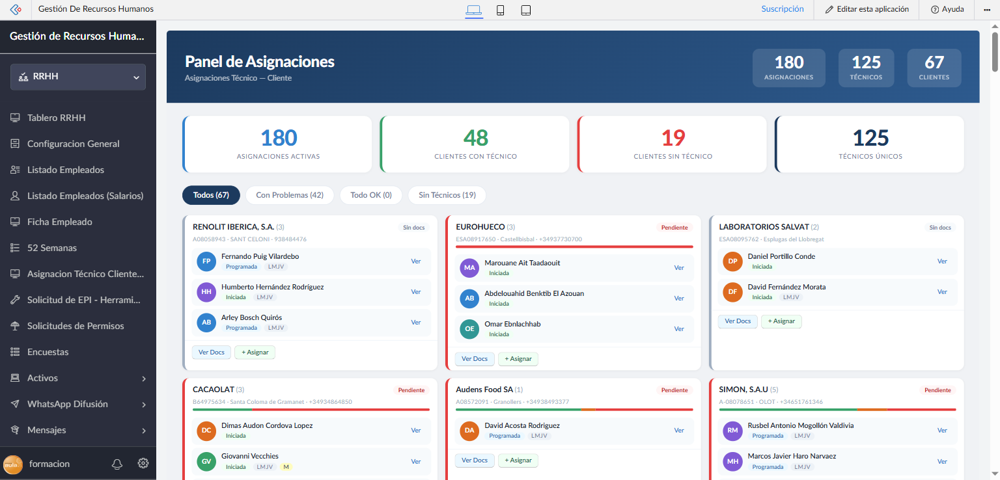

**Ruta de menú:** RRHH → Dashboards y Analíticas → Panel de Asignaciones
**URL directa:** `#Page:Panel_de_Asignaciones`

El **Panel de Asignaciones** es una vista visual centralizada del estado de todas las asignaciones técnico-cliente, diseñada para detectar rápidamente problemas de cobertura.

**KPIs superiores:**

| KPI | Qué muestra |
|-----|-------------|
| **Total Asignaciones** | Número total de asignaciones activas en el sistema |
| **Clientes con Técnico** | Clientes que tienen al menos un técnico asignado |
| **Clientes sin Técnico** | Clientes sin ningún técnico asignado (⚠️ requiere atención) |
| **Técnicos activos** | Número de técnicos con asignaciones activas |

**Filtros de vista (CSS-only, sin recarga):**

| Filtro | Qué muestra |
|--------|-------------|
| **Todos** | Todos los clientes |
| **Con Problemas** | Clientes con incidencias en documentación o asignación |
| **Todo OK** | Clientes en estado correcto |
| **Sin Técnicos** | Solo clientes sin técnico asignado |

**Tarjetas de cliente:**
Cada cliente aparece como una tarjeta que muestra:
- Nombre del cliente
- Lista de avatares con las iniciales de los técnicos asignados
- Indicadores de estado de documentación

Al hacer clic en el avatar de un técnico se abre su **Ficha Empleado**.

---

## 5. EPIs y Herramientas

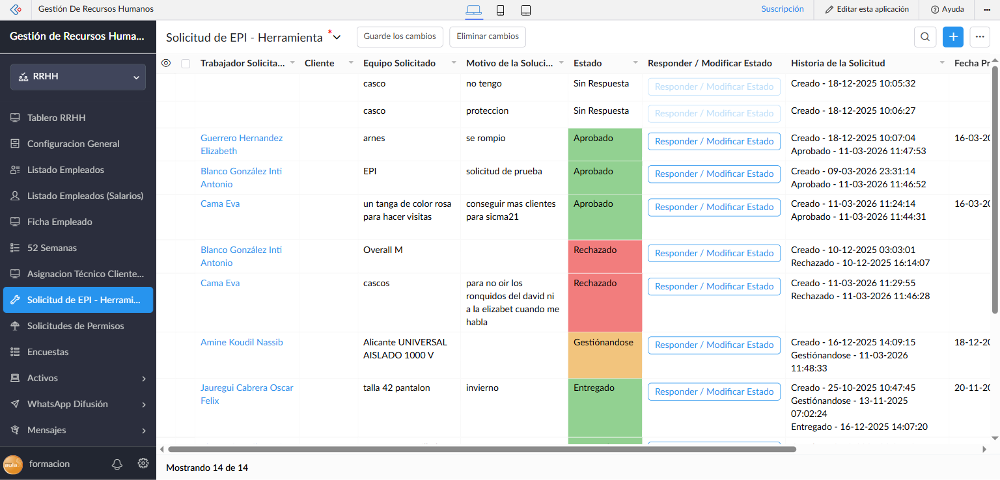

**Ruta de menú:** RRHH → Solicitud de EPI - Herramientas
**URL directa:** `#Report:Solicitudes_de_EPIs_Herramientas_Report`

Vista de gestión de todas las solicitudes de EPI, ropa de trabajo y herramientas recibidas de los empleados.

**Columnas del reporte:**

| Columna | Descripción |
|---------|-------------|
| **Empleado** | Trabajador que realizó la solicitud |
| **Tipo** | EPI / ROPA / HERRAMIENTA |
| **Equipo Solicitado** | Descripción del equipo pedido |
| **Estado** | Estado actual de la solicitud |
| **Historia de la Solicitud** | Registro de cambios de estado con timestamps |
| **Nota Sobre Respuesta** | Observaciones del gestor |

**Estados de la solicitud:**

| Estado | Significado |
|--------|-------------|
| **Pendiente** | En espera de revisión |
| **Aprobado / Gestionándose** | Aprobada, pendiente de entrega física |
| **Entregado** | Equipo entregado al empleado |
| **Rechazado** | Solicitud denegada |
| **Confirmado** | Empleado confirmó la recepción |

**Acciones disponibles:**
- **Responder / Modificar Estado** — cambia el estado de la solicitud y añade notas
- **Asignar equipo** — registra el equipo específico que se entregará

**Flujo típico de gestión:**
1. Empleado envía solicitud → estado **Pendiente**
2. Gestor revisa → cambia a **Aprobado / Gestionándose**
3. Se gestiona el equipo físico → cambia a **Entregado**
4. Empleado confirma recepción desde su portal → estado **Confirmado**

---

## 6. Solicitudes de Permisos

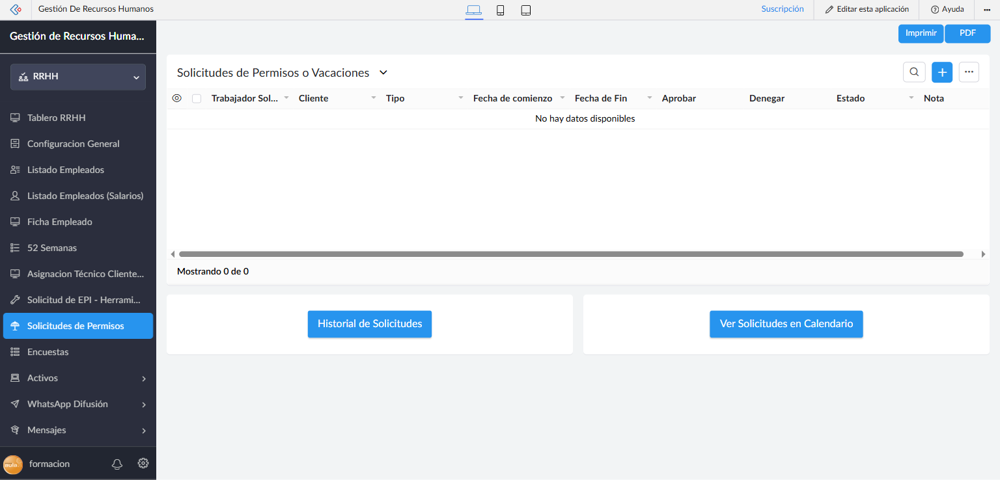

**Ruta de menú:** RRHH → Solicitudes de Permisos
**URL directa:** `#Page:Tablero_Solicitudes`

Gestión centralizada de todas las solicitudes de permisos y vacaciones enviadas por los empleados.

**Panel de solicitudes pendientes:**
Muestra las solicitudes con estado **Sin Respuesta** que requieren acción inmediata.

**Columnas:**

| Columna | Descripción |
|---------|-------------|
| **Empleado** | Trabajador que solicitó el permiso |
| **Tipo** | Vacaciones / Permiso Retribuido / Permiso no Retribuido |
| **Fecha Inicio** | Inicio del período solicitado |
| **Fecha Fin** | Fin del período |
| **Estado** | Sin Respuesta / Aprobado / Rechazado |
| **Nota** | Comentario del empleado |

**Botones de acción:**
- **Historial de Solicitudes** — accede al listado completo histórico con todos los estados
- **Ver Solicitudes en Calendario** — vista mensual de todos los permisos aprobados

> **Notificación automática a RRHH:** Cuando un empleado envía una nueva solicitud de permiso, el personal configurado en *Configuración General → Solicitudes de Permisos* recibe automáticamente una notificación por los canales activos (push, correo HTML y/o WhatsApp).

**Aprobar o rechazar una solicitud:**
1. Localiza la solicitud en la lista de pendientes
2. Abre el registro (clic en la fila)
3. Cambia el estado a **Aprobado** o **Rechazado**
4. Añade nota opcional
5. Guarda — el empleado recibe notificación automática

---

## 7. Mensajes de Empleados

### 7.1 Lista de Conversaciones

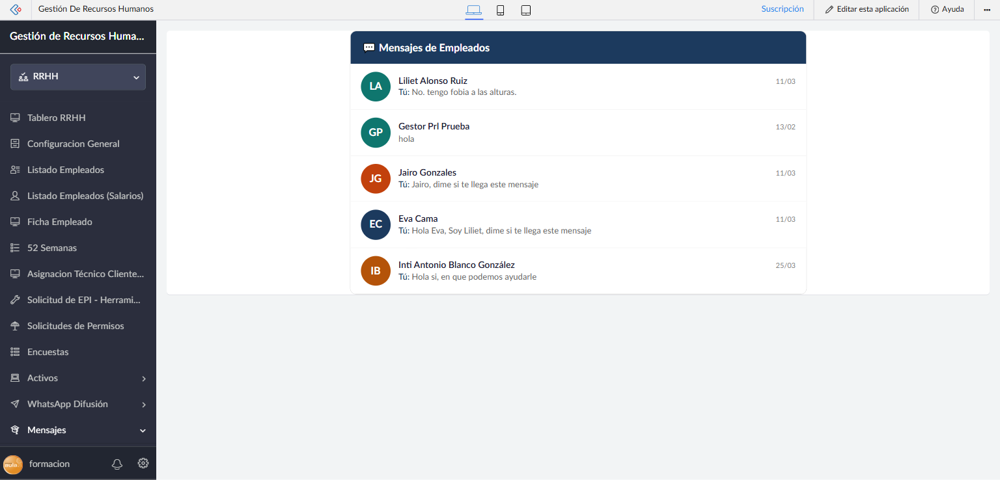

**Ruta de menú:** RRHH → Mensajes → Mensajes Recibidos
**URL directa:** `#Page:Lista_Conversaciones`

Vista tipo bandeja de entrada que muestra todas las conversaciones abiertas con empleados.

**Cada entrada de la lista muestra:**
- **Avatar con iniciales** del empleado (con color único por persona)
- **Nombre completo** del empleado
- **Último mensaje** (preview de las primeras palabras)
- **Fecha** del último mensaje

Al hacer clic en una conversación, se abre el **Chat RRHH** para ese empleado.

> Los mensajes no leídos se marcan automáticamente como leídos al abrir la conversación. El KPI "Mensajes Empleados" del Tablero RRHH se actualiza en tiempo real.

### 7.2 Chat RRHH

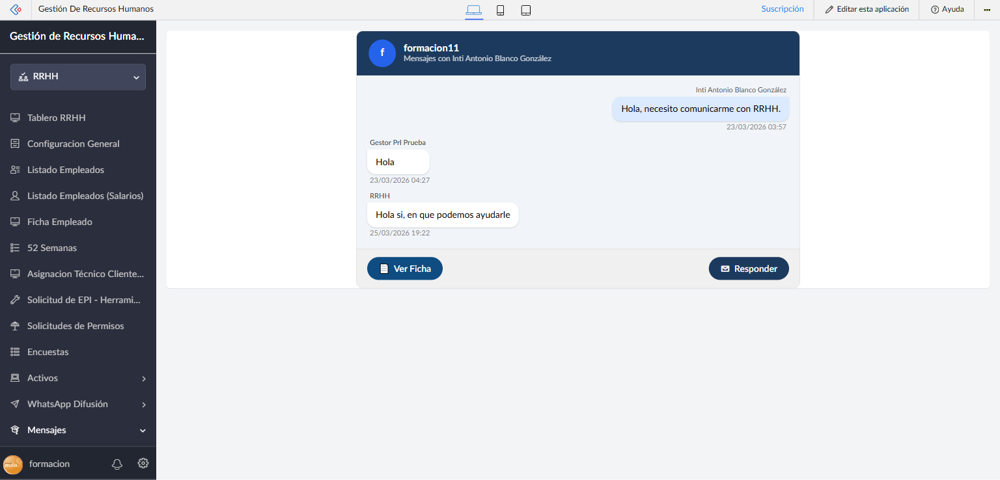

**URL directa:** `#Page:Chat_RRHH?TecnicoNo={id_empleado}`

Vista de conversación individual con un empleado, con interfaz tipo chat.

**Elementos de la interfaz:**

| Elemento | Descripción |
|----------|-------------|
| **Header** | Avatar + "Mensajes con {nombre del empleado}" |
| **Burbujas derechas (azul claro)** | Mensajes enviados por el empleado |
| **Burbujas izquierdas (blancas)** | Respuestas del equipo de RRHH, con etiqueta del autor |
| **Marca de tiempo** | Fecha y hora de cada mensaje |

**Botones del footer:**
- **📄 Ver Ficha** — abre la Ficha Empleado completa en otra vista
- **✉ Responder** — abre el formulario para enviar un mensaje de respuesta

**Proceso para responder:**
1. Abre la conversación desde la Lista de Conversaciones
2. Pulsa **✉ Responder**
3. En el formulario: escribe el mensaje en el campo de texto
4. Pulsa **Enviar**
5. El mensaje aparece en el chat con la etiqueta del autor de RRHH que respondió

> El sistema registra automáticamente quién responde: el mensaje muestra el nombre del gestor logueado o "RRHH" si el emisor es la cuenta general.

---

## 8. Dashboards y Analíticas

### 8.1 Semáforo Caducidades EPI

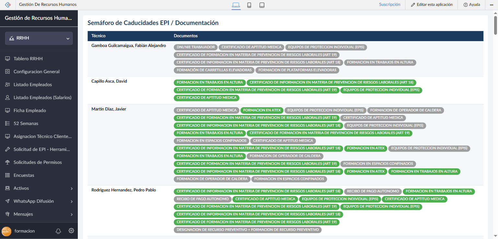

**Ruta de menú:** RRHH → Dashboards y Analíticas → Semáforo Caducidades EPI
**URL directa:** `#Page:Sem_foro_Caducidades_EPI`

Vista visual del estado de caducidad de toda la documentación EPI y de prevención de riesgos laborales de cada técnico.

**Estructura:**

| Columna | Descripción |
|---------|-------------|
| **Técnico** | Nombre del trabajador |
| **Documentos** | Pills de colores para cada documento requerido |

**Código de colores de los pills:**

| Color | Estado del documento |
|-------|---------------------|
| 🟢 Verde | Vigente y actualizado |
| 🟡 Amarillo | Próximo a caducar (dentro de 30 días) |
| 🔴 Rojo | Caducado |
| ⚫ Gris | Pendiente de subir |

Cada pill muestra el nombre del tipo de documento (ej. "CERTIFICADO DE APTITUD MEDICA", "EQUIPOS DE PROTECCION INDIVIDUAL (EPIS)"). Al identificar pills grises o rojos, el gestor sabe qué documentación debe solicitar o renovar.

### 8.2 Timeline de Permisos

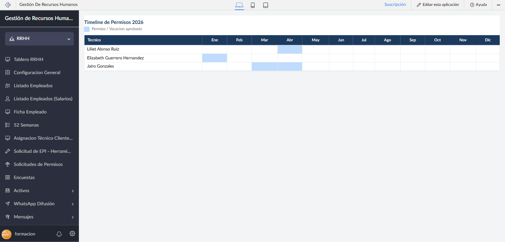

**Ruta de menú:** RRHH → Dashboards y Analíticas → Timeline Permisos
**URL directa:** `#Page:Timeline_Permisos`

Tabla anual que muestra de un vistazo todos los permisos y vacaciones aprobados del equipo.

**Estructura:**

| Elemento | Descripción |
|----------|-------------|
| **Filas** | Un técnico por fila |
| **Columnas** | Los 12 meses del año (Ene — Dic) |
| **Celdas azules** | Período de permiso / vacación aprobado |
| **Leyenda** | "Permiso / Vacación aprobado" (azul claro) |

Permite planificar la cobertura de clientes detectando solapamientos de ausencias entre técnicos asignados al mismo cliente.

---

## 9. Formaciones

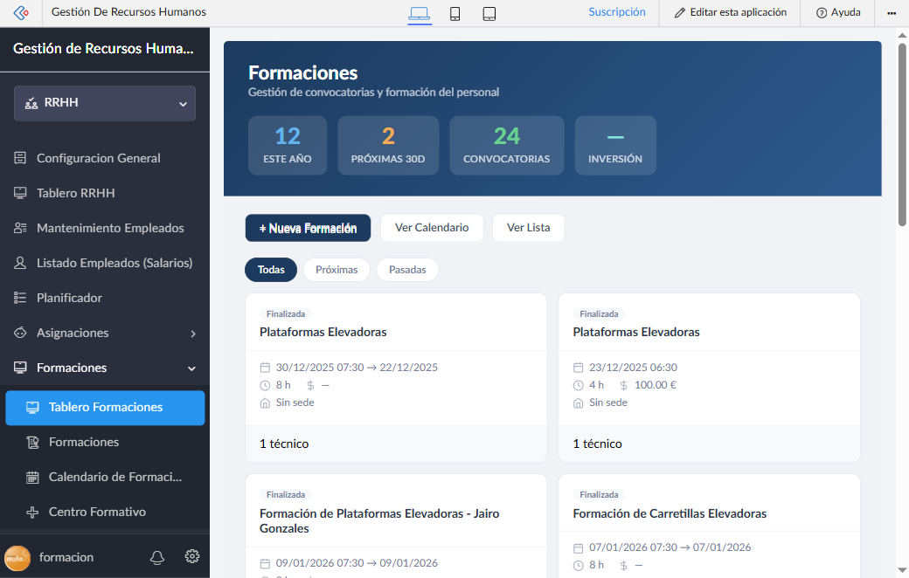

**Ruta de menú:** Formaciones → Tablero Formaciones
**URL directa:** `#Page:Tablero_Formaciones`
**Perfiles:** Gestor RRHH, Supervisor, Super Administrador

El **Tablero Formaciones** centraliza la gestión de todas las formaciones programadas para el personal. Permite ver de un vistazo el estado general de la formación de la plantilla.

### KPIs superiores

| KPI | Qué mide |
|-----|----------|
| **Este año** | Formaciones realizadas o programadas en el año en curso |
| **Próximas 30D** | Formaciones que comienzan en los próximos 30 días |
| **Convocatorias** | Total de inscripciones de técnicos en formaciones |
| **Inversión** | Coste total acumulado de formaciones (cuando está registrado) |

### Botones de acción rápida

| Botón | Acción |
|-------|--------|
| **+ Nueva Formación** | Abre el formulario para registrar una nueva formación |
| **Ver Calendario** | Vista de calendario con las fechas de todas las formaciones |
| **Ver Lista** | Vista tabular del listado completo |

### Filtros de vista

Sin necesidad de recargar la página, puedes cambiar qué formaciones se muestran:

| Filtro | Qué muestra |
|--------|-------------|
| **Todas** | El listado completo |
| **Próximas** | Solo formaciones con fecha futura |
| **Pasadas** | Solo formaciones ya finalizadas |

### Tarjetas de formación

Cada formación aparece como una tarjeta (tres columnas) que muestra:
- **Badge de estado** (Finalizada / Próxima / En curso)
- **Nombre** de la formación
- **Rango de fechas**, duración y coste
- **Sede / ubicación**
- **Número de técnicos** convocados (indicador "N técnico/s")

### Cómo registrar una nueva formación

1. Haz clic en **+ Nueva Formación**.
2. Rellena los campos: nombre, centro formativo, sede, fechas de inicio y fin, duración y coste.
3. En el campo **Técnicos a convocar**, selecciona los trabajadores participantes.
4. Pulsa **Enviar** — la formación aparece automáticamente en el tablero y en la sección **Mis Formaciones** del portal de los técnicos convocados.

---

## 10. Configuración General

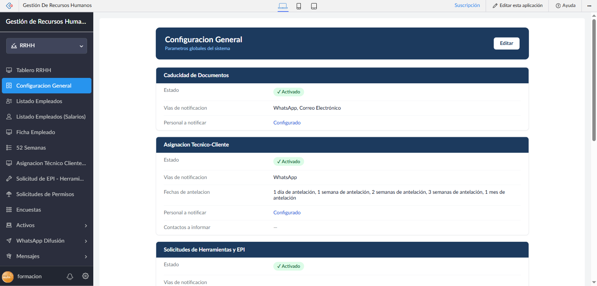

**Ruta de menú:** RRHH → Configuración General
**URL directa:** `#Page:Configuracion_General`

Panel de administración de los parámetros globales del sistema. Agrupa en una sola vista todas las configuraciones de notificaciones y automatizaciones de la aplicación.

Pulsa **Editar** (botón superior derecha) para modificar cualquier valor.

### Secciones de configuración

#### Caducidad de Documentos
Controla las notificaciones automáticas cuando un documento está próximo a caducar o ha caducado.

| Parámetro | Descripción |
|-----------|-------------|
| **Estado** | Activado / Desactivado |
| **Vías de notificación** | WhatsApp, Correo Electrónico (configurable) |
| **Personal a notificar** | Lista de destinatarios configurada |

#### Asignación Técnico-Cliente
Notificaciones sobre asignaciones de técnicos a clientes.

| Parámetro | Descripción |
|-----------|-------------|
| **Estado** | Activado / Desactivado |
| **Vías de notificación** | WhatsApp (configurable) |
| **Fechas de antelación** | Cuándo avisar: 1 día, 1 semana, 2 semanas, 3 semanas, 1 mes |
| **Personal a notificar** | Destinatarios internos |
| **Contactos a informar** | Personas de contacto del cliente (opcional) |

#### Solicitudes de Herramientas y EPI
Notificaciones cuando un empleado solicita un EPI, herramienta o ropa de trabajo.

| Parámetro | Descripción |
|-----------|-------------|
| **Estado** | Activado / Desactivado |
| **Vías de notificación** | Configurable |
| **Personal a notificar** | Destinatarios de la notificación |

#### Solicitudes de Permisos
Notificaciones para el flujo de solicitud y respuesta de permisos.

| Parámetro | Descripción |
|-----------|-------------|
| **Notif. nuevas solicitudes** | Avisa al gestor cuando llega una solicitud nueva |
| **Vías de notificación** | Configurable |
| **Personal a notificar** | Destinatarios |
| **Notif. respuesta a empleados** | Avisa al empleado cuando RRHH responde su solicitud |
| **Vías notif. respuesta** | Canal para notificar al empleado |

#### Mensajes RRHH y Empleados
| Parámetro | Descripción |
|-----------|-------------|
| **Notif. respuesta RRHH** | Avisa al empleado cuando RRHH le responde un mensaje |

#### Notificaciones de Alta de un Empleado
Avisa al grupo de RRHH que configures cuando un trabajador pasa a estado **Activo** (alta).

| Parámetro | Descripción |
|-----------|-------------|
| **Vías de notificación** | WhatsApp, Correo Electrónico (configurable) |
| **Personal a notificar** | Usuarios seleccionados en "Usuarios a notificar". Si no hay ninguno, se muestra ⚠ *Ninguno configurado* |

> **Cómo se dispara:** al editar la ficha de un empleado y cambiar **Estado del Empleado** a `Activo`. Solo notifica en la transición real (no se repite en ediciones posteriores si el empleado ya estaba Activo).

#### Notificaciones de Baja de un Empleado
Avisa al grupo de RRHH que configures cuando un trabajador pasa a estado **Inactivo-Baja**.

| Parámetro | Descripción |
|-----------|-------------|
| **Vías de notificación** | WhatsApp, Correo Electrónico (configurable) |
| **Personal a notificar** | Usuarios seleccionados en "Usuarios a Notificar". Si no hay ninguno, se muestra ⚠ *Ninguno configurado* |

> **Cómo se dispara:** al editar la ficha de un empleado y cambiar **Estado del Empleado** a `Inactivo-Baja`. El mensaje incluye la nota de baja si el campo "Nota en caso de baja" está relleno.

> **Requisito para que la notificación llegue:** cada usuario seleccionado debe tener su ficha de empleado vinculada (campo "Registro de Empleado") con el email de notificaciones y/o móvil rellenos, según la vía elegida.

#### Bienvenida a Trabajadores
Configura el correo de bienvenida que se envía automáticamente al dar de alta a un trabajador.

| Parámetro | Descripción |
|-----------|-------------|
| **Asunto del correo** | Línea de asunto del email de bienvenida |
| **Plantilla (preview)** | Preview del cuerpo del mensaje con variables `{nombre}` etc. |

#### Integración WhatsApp
Parámetros de conexión con el servidor WhatsApp para el envío de notificaciones.

| Parámetro | Descripción |
|-----------|-------------|
| **URL del servidor** | Endpoint del servidor WhatsApp (ej. `whatsapp.sicma21.com`) |
| **API Key** | Clave de autenticación (enmascarada: `••••••jawm`) |
| **Cuenta WhatsApp** | Nombre de la cuenta remitente (ej. "Zoho PRL") |

---

## 11. Filtros en Reportes

Los reportes de Zoho Creator ofrecen tres mecanismos de filtrado que se complementan. Entender cuál usar en cada situación permite localizar registros con rapidez y guardar vistas de trabajo reutilizables.

| Mecanismo | Quién lo configura | Se guarda | Cuándo usarlo |
|-----------|-------------------|-----------|---------------|
| **Búsqueda** | El usuario directamente | No | Localizar un registro concreto por texto |
| **Filtros rápidos** | El usuario directamente | Solo en la sesión actual | Exploración puntual (p. ej., filtrar por estado o por mes) |
| **Filtros personalizados predefinidos** | Un administrador los define; el usuario los selecciona | Sí — permanentes | Vistas de trabajo habituales que se usan repetidamente |

---

### 11.1 Búsqueda y filtros rápidos

#### Barra de búsqueda

La mayoría de los reportes muestran una **barra de búsqueda** en la parte superior. Escribe cualquier texto y el reporte muestra solo las filas que contienen ese valor en los campos indexados (nombre, referencia, email…).

> **Nota:** La búsqueda es de texto libre y aplica a todos los campos visibles. No se guarda al abandonar el reporte.

#### Filtros rápidos (ícono de embudo)

Los filtros rápidos permiten acotar los registros por valores de campos concretos (listas desplegables, fechas, casillas de verificación) sin necesidad de intervención de un administrador.

**Pasos para aplicar un filtro rápido:**

1. Abre el reporte que quieres filtrar (p. ej., **Solicitudes Permisos**, **Inventario EPI**…).
2. Busca el **ícono de embudo** (🔽) en la barra de acciones del reporte, arriba a la derecha.
3. Haz clic en el embudo — se despliega el panel de filtros con los campos disponibles.
4. Selecciona los valores que quieres filtrar (p. ej., Estado = "Pendiente").
5. El reporte se actualiza al instante mostrando solo los registros que coinciden.
6. Para añadir más condiciones, selecciona valores en otros campos del mismo panel.
7. Para eliminar el filtro, abre el panel de nuevo y deselecciona los valores, o busca la opción **Limpiar filtros**.

> **Importante:** Los filtros rápidos son **temporales**. Al salir del reporte o recargar la página, la vista vuelve a mostrar todos los registros. Si necesitas una vista filtrada que persista, usa un filtro personalizado predefinido (→ §11.2).

---

### 11.2 Filtros personalizados predefinidos

Los **filtros personalizados predefinidos** son vistas con nombre que un administrador ha configurado de antemano. Permiten cambiar de un vistazo la "lente" con la que se visualiza el reporte: por ejemplo, ver solo permisos de este mes, solo técnicos activos, o solo documentos caducados.

#### Cómo identificarlos

Cuando un reporte tiene filtros predefinidos configurados, aparece una **flecha desplegable (▾) junto al nombre del reporte** en la cabecera. Al hacer clic se muestra la lista de filtros disponibles.

#### Pasos para aplicar un filtro predefinido

1. Abre el reporte (p. ej., **Employee Details**, **Solicitud_Report**, **Inventario EPI**).
2. Localiza la **flecha ▾** junto al título del reporte en la cabecera.
3. Haz clic — se despliega el menú con los filtros disponibles (p. ej., "Activos", "Pendientes", "Este mes"…).
4. Selecciona el filtro que necesitas — el reporte se actualiza mostrando solo los registros de ese criterio.
5. Para volver a ver todos los registros, selecciona **"Todos los registros"** (primera opción del menú).

> **Consejo:** Si el reporte no muestra la flecha ▾, significa que no tiene filtros predefinidos configurados. Solicita al administrador que los cree siguiendo los pasos del §11.3.

#### Ejemplo de uso habitual

| Escenario | Filtro a seleccionar |
|-----------|---------------------|
| Revisar solo permisos pendientes de respuesta | "Pendientes de aprobación" |
| Ver solo empleados activos en el listado | "Activos" |
| Documentos PRL caducados esta semana | "Caducados recientes" |
| Solicitudes de EPI sin atender | "Sin gestionar" |

Los nombres exactos de los filtros disponibles dependen de los que haya configurado el administrador para cada reporte concreto.

---

### 11.3 Crear filtros predefinidos (Administradores)

> **Perfil requerido:** Super Administrador — acceso al **App IDE** de Zoho Creator.

Esta sección explica cómo un administrador crea filtros con nombre que luego aparecen disponibles para todos los usuarios del reporte.

#### Pasos en el App IDE

1. Accede al **App IDE** de Zoho Creator:
   `https://creator.zoho.com/appbuilder/formacion11/human-resource-management/`

2. En el panel izquierdo, localiza el **reporte** al que quieres añadir filtros (sección **Reports**).

3. Haz clic sobre el nombre del reporte para abrirlo en el editor.

4. En el panel de propiedades del reporte (lado derecho o pestaña **Properties**), busca la sección **Custom Filters** (Filtros personalizados).

5. Haz clic en **+ Add Filter** (o el equivalente en la interfaz actual).

6. Rellena los campos del nuevo filtro:

   | Campo | Descripción |
   |-------|-------------|
   | **Filter Name** | Nombre que verán los usuarios en el menú desplegable (p. ej., "Pendientes de aprobación") |
   | **Field** | Campo del formulario por el que se filtra (p. ej., `Estado`) |
   | **Operator** | Condición: `igual a`, `contiene`, `es anterior a`, `está vacío`… |
   | **Value** | Valor concreto (p. ej., `Pendiente`) |

7. Para añadir más condiciones al mismo filtro (lógica AND/OR), haz clic en **+ Condition** y repite.

8. Haz clic en **Save** (o **Done**) para guardar el filtro.

9. Repite los pasos 5–8 para crear tantos filtros con nombre como necesites.

10. **Publica los cambios** del reporte para que estén disponibles en el portal.

> **Resultado:** A partir de ese momento, el reporte mostrará la flecha ▾ junto a su nombre en el portal, y los usuarios podrán seleccionar cualquiera de los filtros que acabas de definir.

#### Recomendaciones de nomenclatura

- Usa nombres cortos y orientados a la tarea del usuario: **"Pendientes"**, **"Este mes"**, **"Caducados"**.
- Evita nombres técnicos con nombres de campo (p. ej., "Estado = Pendiente") — el usuario no necesita saber qué criterio se aplica, solo el resultado que ve.
- Incluye siempre una opción que muestre todos los registros (Zoho la añade automáticamente como "All Records" / "Todos").

---

## 12. STOP2 — Control de Análisis Previos

El sistema **STOP2** (Seguridad en el Trabajo: Observación y Prevención) registra el análisis de seguridad que cada técnico realiza antes de intervenir en las instalaciones de un cliente. Desde el panel RRHH puedes consultar todos los registros y hacer seguimiento de su cumplimiento.

### 12.1 Reporte STOP2

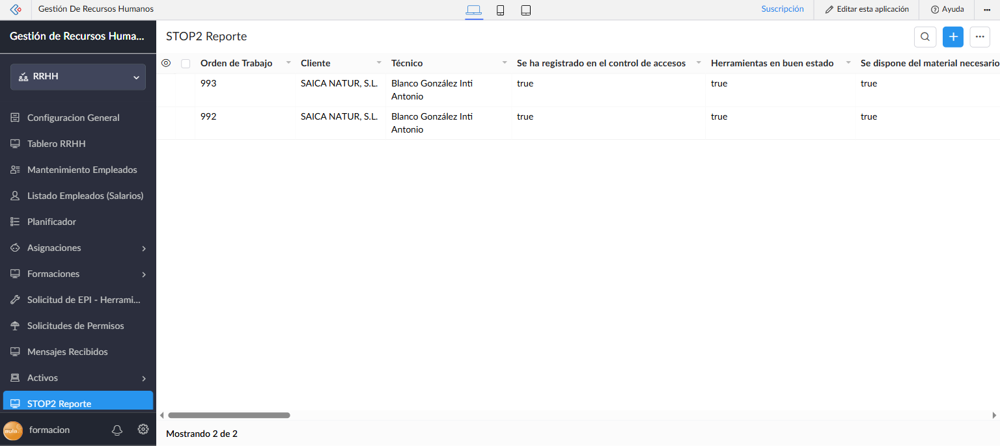

**Ruta de menú:** RRHH → STOP2 Análisis Previo → STOP2 Reporte
**URL directa:** `#Report:STOP2_Analisis_Previo_Report`

Listado completo de todos los checklists STOP2 enviados por los técnicos, independientemente del cliente o del técnico.

**Columnas principales:**

| Columna | Descripción |
|---------|-------------|
| **Empleado** | Técnico que realizó el análisis |
| **Cliente** | Cliente donde se realizó la intervención |
| **Orden de Trabajo** | Número o referencia de la orden de trabajo asociada |
| **Fecha Checklist** | Fecha y hora en que el técnico envió el análisis |
| **Valida Intervención** | ✅ Sí — checklist completamente correcto / ❌ No — hay alertas pendientes |

**Significado de "Valida Intervención":**

El sistema calcula automáticamente si el análisis es válido en el momento en que el técnico lo envía:

| Resultado | Causa |
|-----------|-------|
| **Válido (Sí)** | Todos los ítems de seguridad están marcados correctamente |
| **No válido (No)** | Hay uno o más ítems críticos sin marcar, o hay condiciones de riesgo marcadas como presentes |

> Los ítems críticos que invalidan una intervención son: Trabajos Eléctricos, ATEX, Alturas y Espacios Confinados (sección Acceso), así como Zona de Obra, Zona Vehículos, Intemperie (sección Entorno) y Limpieza deficiente (Materiales).

**Acciones disponibles:**
- **Ver registro** — abre el detalle completo del checklist (los 21 ítems individuales)
- **Búsqueda y filtros** — filtra por técnico, cliente, fecha o resultado de validación (ver §11)
- **Exportar** — descarga el listado en Excel/CSV para auditorías

**Cómo revisar un análisis con alertas:**
1. Localiza los registros con **Valida Intervención = No**
2. Haz clic en la fila para abrir el detalle
3. Revisa qué ítems están marcados incorrectamente (aparecen destacados)
4. Coordina con el técnico si hay condiciones de riesgo no resueltas antes de la intervención

### 12.2 Informe semanal automático a clientes

El sistema envía automáticamente un **informe semanal de cumplimiento STOP2** cada lunes a las 09:00 h, dirigido a los contactos de cada cliente.

**Contenido del informe:**
- Resumen de todos los checklists realizados la semana anterior en las instalaciones del cliente
- Por cada checklist: fecha, nombre del técnico, número de orden de trabajo, porcentaje de cumplimiento (ítems correctos / 21) y estado (OK o número de alertas críticas)

**Destinatarios:**
La ficha de cada cliente tiene un campo dedicado **"Email para enviar reporte STOP 2"** — si está relleno, el informe se envía **únicamente** a esa dirección (por ejemplo, el departamento de PRL del cliente).

Si ese campo está vacío, el sistema envía el informe como alternativa a las personas de contacto configuradas en la ficha del cliente (campo "Personas de contacto en planta").

**No es necesaria ninguna acción por parte de RRHH** — el envío es completamente automático. Si un cliente no recibe el informe, verifica que tenga el campo "Email para enviar reporte STOP 2" correctamente configurado, o al menos un contacto con email registrado en "Personas de contacto en planta".

> Detalle completo del funcionamiento y de la configuración por cliente: **[Manual STOP2 — Supervisor](STOP2-supervisor.md)**.

> **Nota:** El informe semanal solo incluye intervenciones de la semana anterior (lunes–domingo). Si no hubo intervenciones en un cliente durante esa semana, ese cliente no recibe correo.

---

## Resumen de funcionalidades por sección

| Sección | Qué puedes hacer |
|---------|-----------------|
| Tablero RRHH | Ver KPIs operativos, acceder a pendientes urgentes, revisar estado de documentación por cliente |
| Listado Empleados | Buscar, filtrar, crear y gestionar trabajadores |
| Ficha Empleado | Ver resumen completo de un trabajador: EPIs, asignaciones, solicitudes |
| 52 Semanas | Visualizar y planificar el calendario laboral anual por técnico |
| Detalle de Semana | Ver turnos diarios de cada técnico en una semana concreta |
| Asignación Técnico-Cliente | Gestionar qué técnicos están asignados a qué clientes |
| Panel de Asignaciones | Vista visual de cobertura: detectar clientes sin técnico |
| Solicitudes EPI | Gestionar y responder solicitudes de EPIs, ropa y herramientas |
| Solicitudes Permisos | Aprobar o rechazar permisos y vacaciones |
| Mensajes — Lista | Ver todas las conversaciones con empleados, detectar no leídos |
| Chat RRHH | Responder mensajes de un empleado en vista tipo chat |
| Semáforo Caducidades | Ver de un vistazo qué documentos EPI están caducados por técnico |
| Timeline Permisos | Ver todos los permisos aprobados del equipo en vista anual |
| **Tablero Formaciones** | Gestionar formaciones del personal: próximas, en curso y pasadas |
| Configuración General | Configurar notificaciones WhatsApp/email y parámetros del sistema, incluidas las de alta/baja de empleados |
| **Filtros en Reportes** | Aplicar filtros rápidos temporales o seleccionar vistas predefinidas con nombre; crear nuevos filtros (admins) |
| **STOP2 — Reporte** | Ver todos los checklists STOP2 enviados, filtrar por resultado (válido / con alertas) |
| **STOP2 — Informe semanal** | El sistema envía automáticamente cada lunes un resumen de cumplimiento a los contactos de cada cliente |

---

*Manual actualizado el 20/07/2026 — Gestión de Recursos Humanos v2026*
