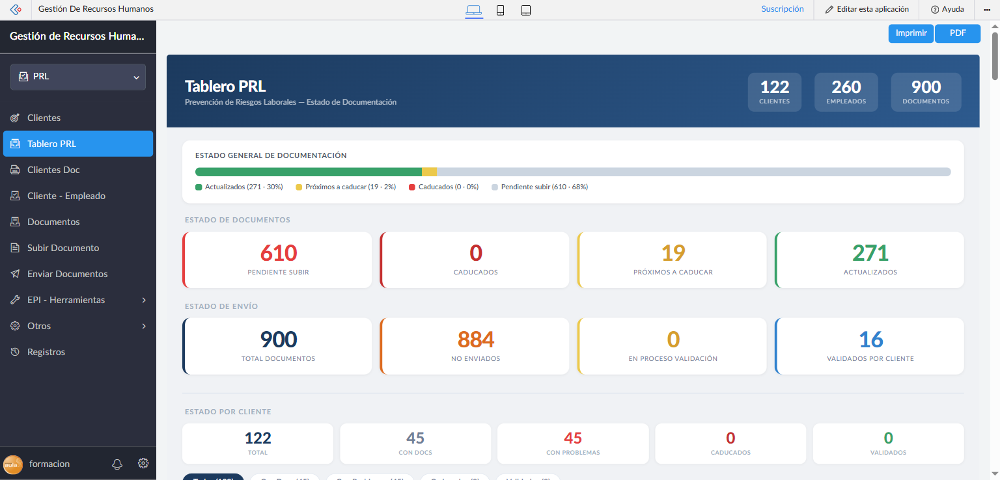
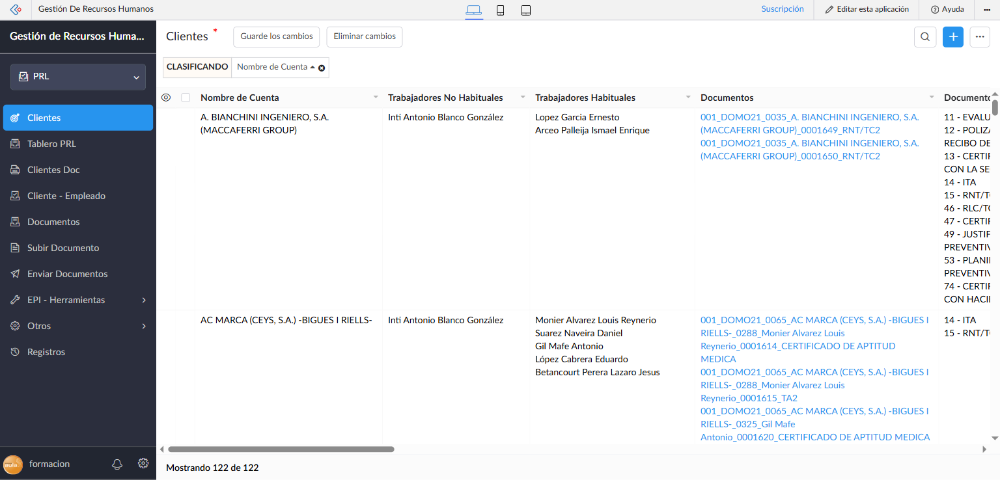
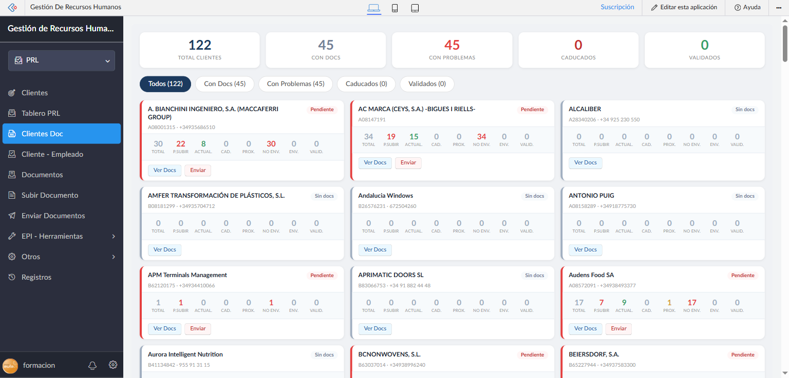
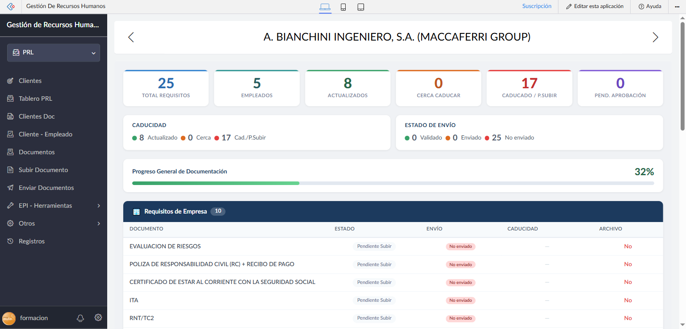
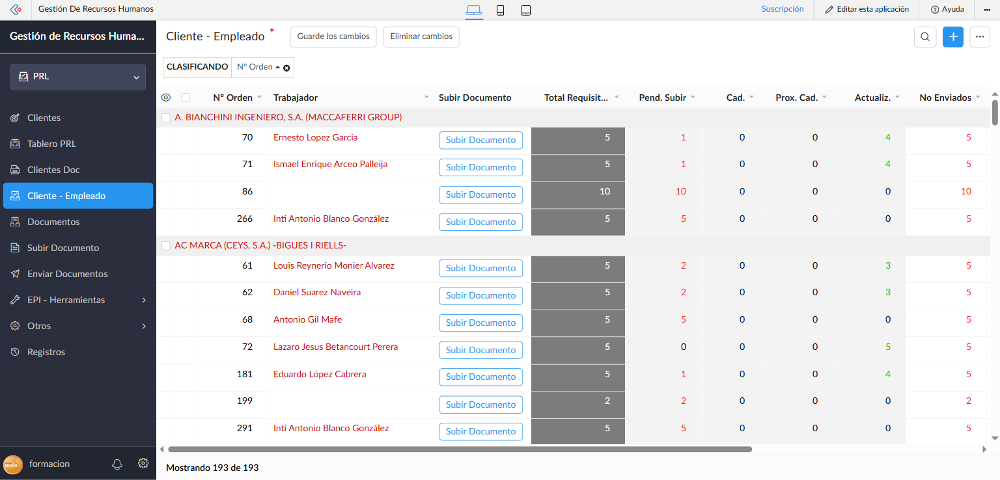
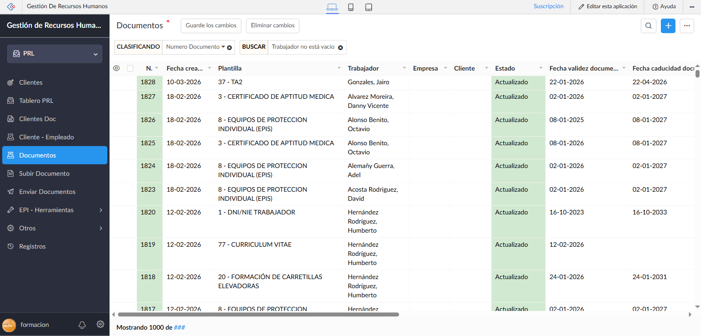
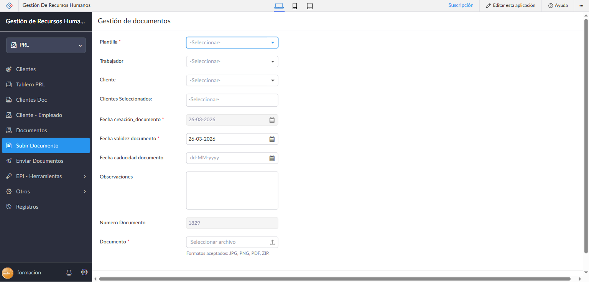
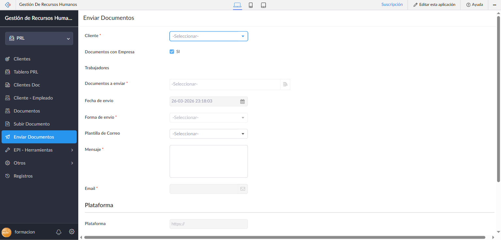

# Módulo C — Sección PRL / CAE

**Perfil:** Responsable CAE, Super Administrador, Gestor RRHH, Operario CAE
**Acceso:** [https://creatorapp.zoho.com/formacion11/human-resource-management/](https://creatorapp.zoho.com/formacion11/human-resource-management/) → selector **PRL**
**Versión:** 1.1 — Abril 2026

---

## Índice

1. [Qué es la sección PRL / CAE](#1-qué-es-la-sección-prl--cae)
2. [Tablero PRL](#2-tablero-prl)
3. [Clientes](#3-clientes)
4. [Clientes Doc — Vista general de documentación](#4-clientes-doc--vista-general-de-documentación)
5. [Documentación del Cliente — Vista de detalle](#5-documentación-del-cliente--vista-de-detalle)
6. [Cliente - Empleado](#6-cliente---empleado)
7. [Documentos](#7-documentos)
8. [Subir Documento](#8-subir-documento)
9. [Enviar Documentos](#9-enviar-documentos)

---

## 1. Qué es la sección PRL / CAE

La sección **PRL** (Prevención de Riesgos Laborales) / **CAE** (Coordinación de Actividades Empresariales) centraliza la gestión de toda la documentación de seguridad y prevención requerida por los clientes a los que la empresa asigna trabajadores.

**Para qué sirve:**
- Hacer seguimiento de qué documentos (de empresa y de cada trabajador) están actualizados, próximos a caducar o pendientes de subir para cada cliente
- Subir y gestionar documentos de prevención (certificados médicos, EPIs, formaciones PRL, etc.)
- Enviar la documentación a los clientes
- Recibir la validación del cliente sobre los documentos enviados

**Cómo acceder:**

Al entrar en la aplicación, el selector de contexto en la parte superior izquierda muestra por defecto **RRHH**. Para cambiar a PRL, hacer clic en ese selector y elegir **PRL**. El menú lateral se actualiza mostrando las opciones propias de esta sección.

---

## 2. Tablero PRL



**Ruta de menú:** PRL → Tablero PRL
**URL directa:** `#Page:Tablero_PRL`

El **Tablero PRL** es el panel de control central de la sección. Muestra en tiempo real el estado de toda la documentación de prevención de la empresa.

**KPIs del header:**

| KPI | Qué mide |
|-----|----------|
| **Clientes** | Total de clientes con documentación PRL activa |
| **Empleados** | Total de trabajadores con requisitos documentales asignados |
| **Documentos** | Total de documentos en el sistema |

**Barra de estado general:**

Muestra la distribución porcentual de todos los documentos según su estado:

| Color | Estado | Significado |
|-------|--------|-------------|
| 🟢 Verde | Actualizados | Documentos vigentes y en regla |
| 🟡 Amarillo | Próximos a Caducar | Caducan en los próximos 30 días |
| 🔴 Rojo | Caducados | Fecha de caducidad superada |
| ⬜ Gris | Pendiente de Subir | Documento requerido pero no entregado |

**Sección "Estado de Documentos" — 4 KPIs individuales:**

| KPI | Color | Descripción |
|-----|-------|-------------|
| **Pendiente Subir** | 🔴 | Nº de documentos que aún no han sido subidos al sistema |
| **Caducados** | 🔴 | Nº de documentos cuya fecha de caducidad ha pasado |
| **Próximos a Caducar** | 🟡 | Nº de documentos que caducan en < 30 días |
| **Actualizados** | 🟢 | Nº de documentos vigentes y correctos |

**Sección "Estado de Envío" — 4 KPIs:**

| KPI | Color | Descripción |
|-----|-------|-------------|
| **Total Documentos** | Azul | Total de documentos en el sistema |
| **No Enviados** | 🟠 | Documentos que aún no se han enviado al cliente |
| **En Proceso Validación** | 🟡 | Enviados al cliente, pendientes de su validación |
| **Validados por Cliente** | 🔵 | Documentos aprobados por el cliente |

**Sección "Estado por Cliente":**

Contadores globales a nivel de cliente (no de documento):

| KPI | Descripción |
|-----|-------------|
| **Total** | Total de clientes |
| **Con Docs** | Clientes que tienen algún documento gestionado |
| **Con Problemas** | Clientes con documentos caducados o pendientes de subir |
| **Caducados** | Clientes con algún documento caducado |
| **Validados** | Clientes con toda la documentación validada |

**Botones de acción:**
- **Imprimir** — Imprime el tablero
- **PDF** — Genera un PDF del estado actual

> El tablero refleja el estado en tiempo real. Los KPIs se actualizan automáticamente cuando cambia el estado de cualquier documento.

---

## 3. Clientes



**Ruta de menú:** PRL → Clientes
**URL directa:** `#Report:Clientes`

Reporte tabular de todos los clientes registrados, con sus trabajadores asignados y la documentación relacionada.

**Columnas:**

| Columna | Descripción |
|---------|-------------|
| **Nombre de Cuenta** | Nombre del cliente (empresa contratante) |
| **Trabajadores No Habituales** | Técnicos asignados puntualmente o sin contrato fijo |
| **Trabajadores Habituales** | Técnicos asignados de forma permanente |
| **Documentos** | Links directos a los documentos subidos para ese cliente |

**Acciones:**
- **Agregar** (botón +) — crea un nuevo cliente
- **Búsqueda** (icono lupa) — filtra por cualquier campo
- Clic en el nombre del cliente → abre el registro completo

> El sistema tiene actualmente **122 clientes** registrados.

---

## 4. Clientes Doc — Vista general de documentación



**Ruta de menú:** PRL → Clientes Doc
**URL directa:** `#Page:Clientes_Doc`

Vista en formato tarjetas (cards) de todos los clientes, con el estado de su documentación PRL de un vistazo. Es la vista principal de trabajo diario para los gestores CAE.

### KPIs superiores

| KPI | Color | Descripción |
|-----|-------|-------------|
| **Total Clientes** | Negro | Total de clientes en el sistema |
| **Con Docs** | Azul | Clientes que tienen al menos un documento gestionado |
| **Con Problemas** | 🔴 | Clientes con documentos caducados o pendientes de subir |
| **Caducados** | 🔴 | Clientes con documentos caducados |
| **Validados** | 🟢 | Clientes con toda la documentación validada |

### Filtros de vista (tabs)

| Tab | Qué muestra |
|-----|-------------|
| **Todos** | Todos los clientes |
| **Con Docs** | Solo clientes con documentos gestionados |
| **Con Problemas** | Clientes con caducidades o pendientes |
| **Caducados** | Solo clientes con documentos caducados |
| **Validados** | Solo clientes completamente validados |

Los filtros son instantáneos (CSS-only, sin recarga de página).

### Tarjetas de cliente

Cada cliente aparece como una tarjeta con:

| Elemento | Descripción |
|----------|-------------|
| **Nombre del cliente** | Razón social |
| **CIF + Teléfono** | Datos de identificación |
| **Badge de estado** | "Pendiente" (rojo) / "Sin docs" (gris) |
| **8 contadores** | Total, P.Subir, Actual., Cad., Prox., No Env., Env., Valid. |
| **Botón "Ver Docs"** | Abre el detalle de documentación de ese cliente |
| **Botón "Enviar"** | Acceso rápido al formulario de envío para ese cliente |

---

## 5. Documentación del Cliente — Vista de detalle



**URL directa:** `#Page:Documentaci_n_del_Cliente?ClienteID={id_cliente}`

Vista detallada de toda la documentación requerida para un cliente específico, accesible desde el botón **"Ver Docs"** de la tarjeta en Clientes Doc.

### Header
- Nombre del cliente en el centro
- Botones de navegación **◄ ►** para ir al cliente anterior/siguiente sin volver al listado

### KPIs del cliente

| KPI | Color | Descripción |
|-----|-------|-------------|
| **Total Requisitos** | Azul | Total de documentos requeridos (empresa + trabajadores) |
| **Empleados** | Verde | Nº de trabajadores asignados a este cliente |
| **Actualizados** | Verde | Documentos vigentes |
| **Cerca Caducar** | Naranja | Documentos próximos a caducar |
| **Caducado / P.Subir** | Rojo | Documentos caducados o sin subir |
| **Pend. Aprobación** | Morado | Documentos enviados pendientes de aprobación del cliente |

### Semáforos

**Caducidad:**
- 🟢 Actualizado — número de docs vigentes
- 🟡 Cerca — próximos a caducar
- 🔴 Cad./P.Subir — caducados o pendientes

**Estado de Envío:**
- 🟢 Validado — aprobados por el cliente
- 🟡 Enviado — enviados, sin respuesta aún
- 🔴 No enviado — documentos no enviados al cliente

### Barra de progreso
Muestra el porcentaje de documentos en estado correcto sobre el total requerido.

### Tablas de requisitos

**Requisitos de Empresa (🏢)**
Documentos requeridos de la empresa (no vinculados a un trabajador concreto):
- Evaluación de Riesgos, Póliza RC, Certificados Seg. Social/Hacienda, ITA, RNT/TC2, RLC/TC1, etc.

**Requisitos de Trabajador (👥)**
Documentos requeridos para cada trabajador asignado al cliente. Los registros se agrupan por nombre de empleado (👤 Nombre (N docs)):

| Columna | Descripción |
|---------|-------------|
| **Documento** | Nombre del tipo de documento requerido |
| **Estado** | Actualizado / Pendiente Subir / Caducado / Cerca de Caducar |
| **Envío** | No enviado / Enviado / Validado |
| **Caducidad** | Fecha de caducidad + días restantes (+N) |
| **Archivo** | Sí / No — indica si hay un archivo subido |

---

## 6. Cliente - Empleado



**Ruta de menú:** PRL → Cliente - Empleado
**URL directa:** `#Report:Trabajadores_Documentos`

Reporte matricial que muestra el estado de documentación de cada par trabajador-cliente, agrupado por cliente. Permite detectar de un vistazo qué trabajadores tienen documentación pendiente en cada cliente.

**Columnas:**

| Columna | Descripción |
|---------|-------------|
| **Nº Orden** | Número de orden de la asignación |
| **Trabajador** | Nombre del técnico (en rojo si tiene documentación pendiente) |
| **Subir Documento** | Botón de acceso rápido al formulario de subida |
| **Total Requisitos** | Total de documentos requeridos para esta asignación |
| **Pend. Subir** | Documentos pendientes de subir |
| **Cad.** | Documentos caducados |
| **Prox. Cad.** | Próximos a caducar |
| **Actualiz.** | Documentos actualizados |
| **No Enviados** | Documentos no enviados al cliente |

**Agrupación:** Los registros se agrupan por cliente (cabecera gris con el nombre del cliente).

> El sistema tiene **193 registros** activos de asignación trabajador-cliente.

---

## 7. Documentos



**Ruta de menú:** PRL → Documentos
**URL directa:** `#Report:Otros_Documentos`

Registro completo de todos los documentos subidos al sistema, con sus metadatos y estado de caducidad.

**Columnas:**

| Columna | Descripción |
|---------|-------------|
| **N.** | Número de documento (autoincremental) |
| **Fecha creación** | Fecha en que se subió el documento |
| **Plantilla** | Tipo de documento (ej. "3 - CERTIFICADO DE APTITUD MEDICA") |
| **Trabajador** | Técnico al que pertenece el documento |
| **Empresa** | Empresa del trabajador |
| **Cliente** | Cliente para el que es válido el documento |
| **Estado** | Estado actual: Actualizado / Próximo Caducar / Caducado / Pendiente |
| **Fecha validez documento** | Fecha desde la que es válido |
| **Fecha caducidad** | Fecha de expiración del documento |

**Filtro por defecto:** Solo muestra documentos con Trabajador asignado (filtro "Trabajador no está vacío").

**Búsqueda avanzada:** Permite filtrar por cualquier combinación de campos — muy útil para localizar documentos de un trabajador o cliente específico.

> El sistema tiene más de **1.000 documentos** registrados.

---

## 8. Subir Documento



**Ruta de menú:** PRL → Subir Documento
**URL directa:** `#Form:Subir_Documento`

Formulario principal para registrar un nuevo documento en el sistema.

**Campos del formulario:**

| Campo | Obligatorio | Descripción |
|-------|:-----------:|-------------|
| **Plantilla** | ✓ | Tipo de documento (ej. DNI/NIE TRABAJADOR, CERTIFICADO DE APTITUD MEDICA, EPI...) |
| **Trabajador** | — | Técnico al que pertenece el documento |
| **Cliente** | — | Cliente para el que es válido |
| **Clientes Seleccionados** | — | Permite asociar el documento a múltiples clientes |
| **Fecha creación_documento** | ✓ | Auto-rellenada con la fecha de hoy (no editable) |
| **Fecha validez documento** | ✓ | Fecha desde la que el documento es válido |
| **Fecha caducidad documento** | — | Se calcula automáticamente según el tipo de plantilla |
| **Observaciones** | — | Texto libre adicional |
| **Numero Documento** | — | Número autoincremental (solo lectura) |
| **Documento** | ✓ | Archivo adjunto (JPG, PNG, PDF, ZIP) |

**Comportamiento automático tras guardar:**
- El workflow `Asignar_Documento_A_Requs` enlaza el documento al requisito correspondiente del cliente
- El workflow `Checar_Estado_Requisito` actualiza el estado del requisito (Actualizado / Próximo Caducar)
- Los contadores del cliente (`ContadorPendietesSubir`, `ContadorActualizados`, etc.) se recalculan en cascada
- El Tablero PRL refleja los nuevos datos

> **Importante:** La Plantilla determina automáticamente el tipo de caducidad. Al seleccionar la plantilla, la fecha de caducidad puede calcularse automáticamente según la configuración del tipo de documento.

---

## 9. Enviar Documentos



**Ruta de menú:** PRL → Enviar Documentos
**URL directa:** `#Form:Env_o_de_documentaci_n`

Formulario para enviar la documentación de un cliente al contacto correspondiente, notificándole de la documentación disponible para revisión.

**Campos del formulario:**

| Campo | Obligatorio | Descripción |
|-------|:-----------:|-------------|
| **Cliente** | ✓ | Selecciona el cliente destinatario del envío |
| **Documentos con Empresa** | — | Incluir documentos de empresa (marcado por defecto) |
| **Trabajadores** | — | Filtro de trabajadores cuyos documentos se enviarán |
| **Documentos a enviar** | ✓ | Selección múltiple de los documentos concretos a enviar |
| **Fecha de envío** | — | Auto-rellenada con la fecha y hora actual |
| **Forma de envío** | ✓ | Canal: Email / Portal / Plataforma externa |
| **Plantilla de Correo** | — | Plantilla de email preconfigurada para el mensaje |
| **Mensaje** | ✓ | Texto del mensaje a enviar |
| **Email** | ✓ | Email del destinatario (se rellena al seleccionar cliente) |
| **Plataforma** | — | URL de la plataforma CAE del cliente (si procede) |

**Sección "Programar Envío":**
Permite programar el envío para una fecha y hora futura en lugar de enviarlo inmediatamente.

**Flujo completo de gestión documental:**

```
1. SUBIR → Subir Documento (formulario)
           ↓ automáticamente el sistema actualiza estado del requisito
2. REVISAR → Documentación del Cliente (ver qué falta)
           ↓ cuando hay documentos listos para enviar
3. ENVIAR → Enviar Documentos (formulario)
           ↓ el cliente recibe la documentación
4. VALIDAR → El cliente revisa y aprueba
           ↓ RRHH marca Aprobado_Cliente = SI en el requisito
5. ACTUALIZADO → El semáforo del cliente se pone en verde
```

---

## Resumen de funcionalidades

| Sección | Qué puedes hacer |
|---------|-----------------|
| Tablero PRL | Ver el estado global de documentación: KPIs, semáforos por estado y por cliente |
| Clientes | Listar y gestionar clientes con sus trabajadores asignados |
| Clientes Doc | Vista tarjeta de todos los clientes con su estado de documentación + acceso rápido |
| Documentación del Cliente | Ver el detalle completo de documentos requeridos por un cliente específico |
| Cliente - Empleado | Ver estado de documentación para cada par trabajador-cliente |
| Documentos | Historial completo de todos los documentos subidos al sistema |
| Subir Documento | Registrar un nuevo documento de trabajador o empresa en el sistema |
| Enviar Documentos | Enviar documentación al cliente por email o plataforma CAE |

---

## Tipos de documentos habituales

Los documentos de la sección PRL se clasifican por **Plantilla**. Las plantillas más comunes son:

**Documentos de empresa:**
- Evaluación de Riesgos
- Póliza de Responsabilidad Civil (RC) + Recibo de Pago
- Certificado Corriente con la Seguridad Social
- Certificado Corriente con Hacienda
- ITA (Informe de cotización)
- RNT/TC2 (Relación Nominal de Trabajadores)
- RLC/TC1 + Recibo de Pago
- Certificado de Adhesión a la Mutua
- Justificante de Modalidad Preventiva
- Planificación de la Actividad Preventiva

**Documentos de trabajador:**
- DNI / NIE Trabajador
- Certificado de Aptitud Médica
- Equipos de Protección Individual (EPIs)
- Certificado de Formación en Materia de PRL (Art. 19)
- Certificado de Información en Materia de PRL (Art. 18)
- Formación en Trabajos en Altura
- Formación en Espacios Confinados
- Formación en ATEX
- Formación de Operador de Caldera
- Autorización de Tareas Peligrosas
- Curriculum Vitae

---

*Manual generado el 26/03/2026 — Gestión de Recursos Humanos v2026*
