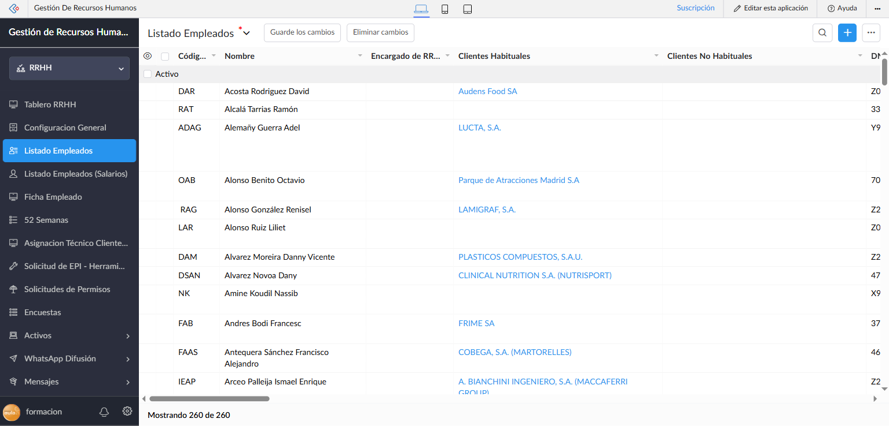
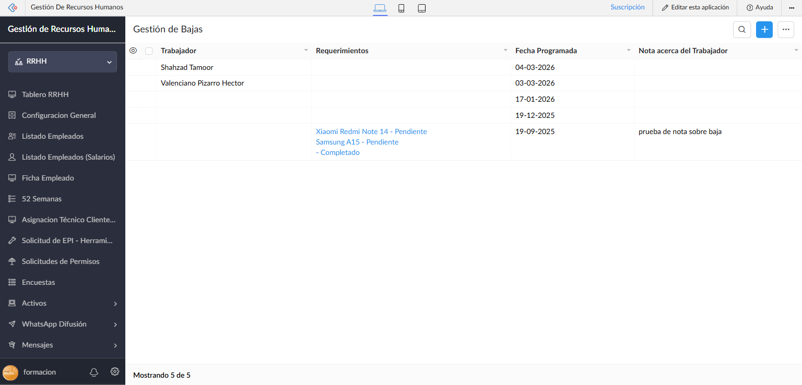
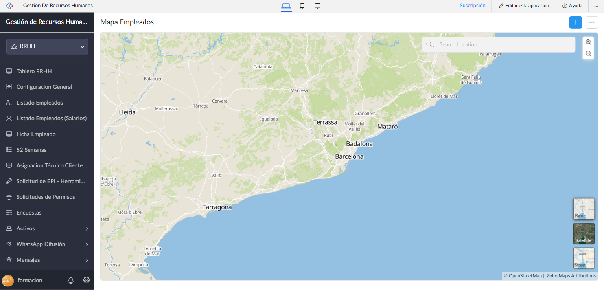
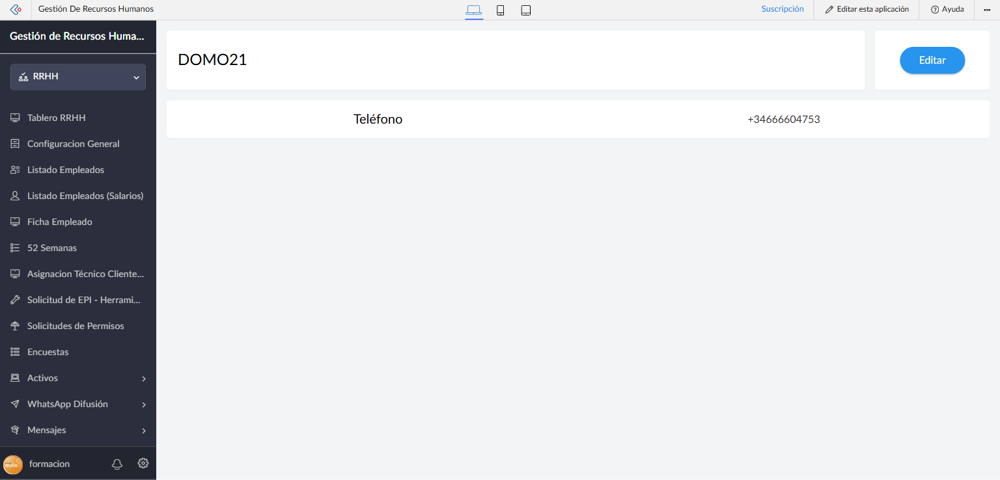
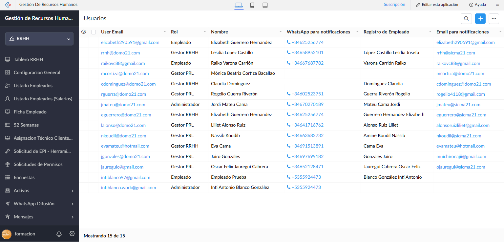
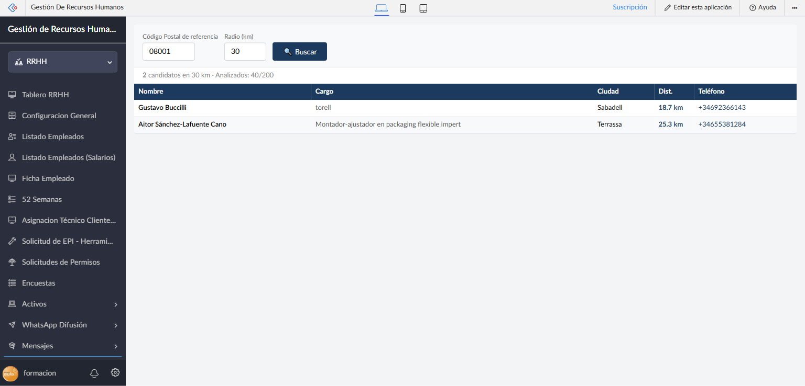
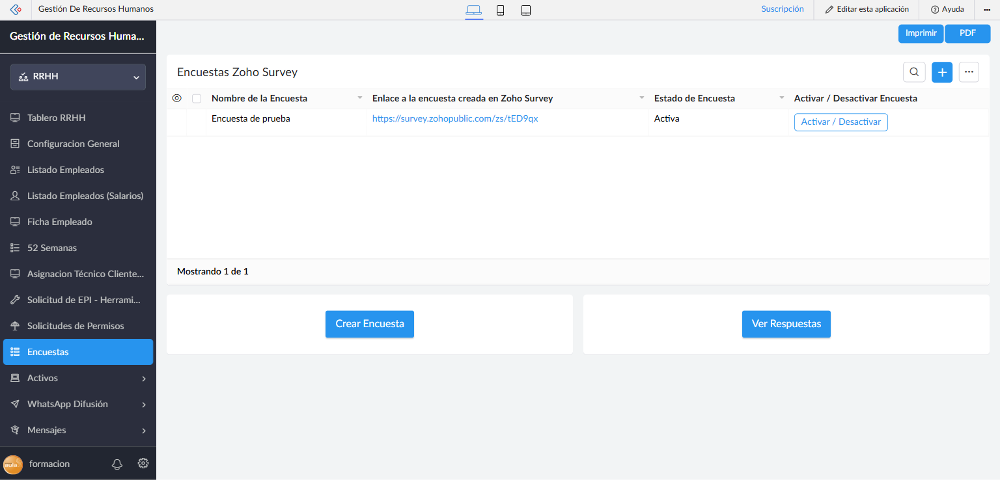
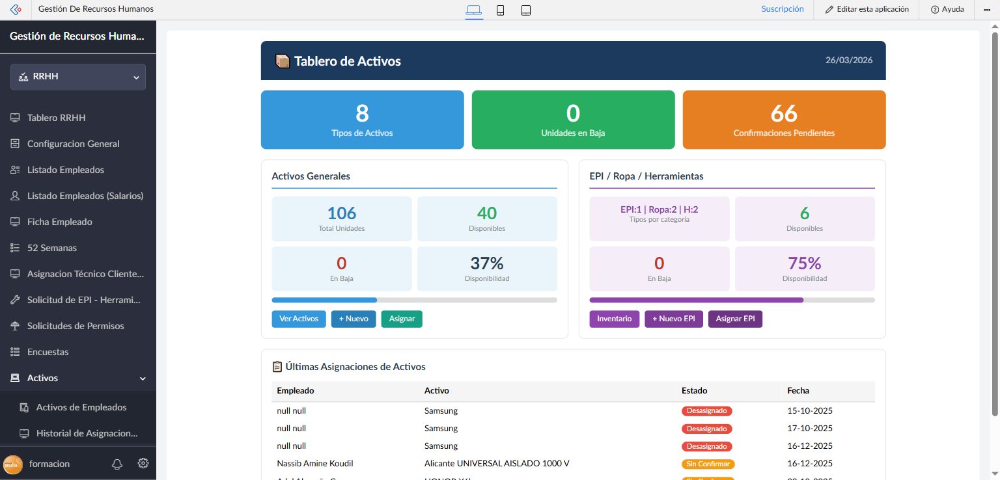
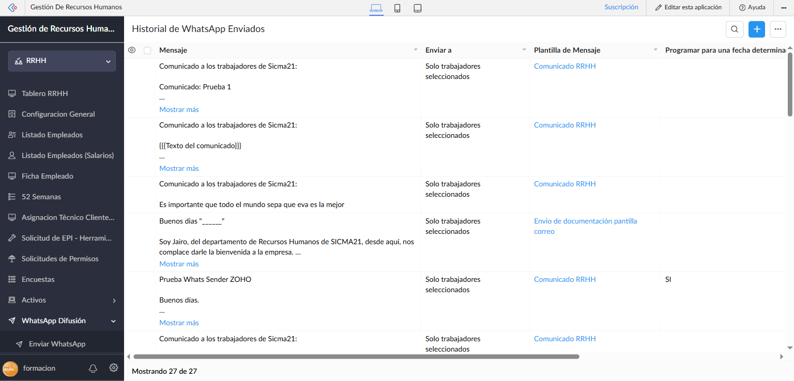
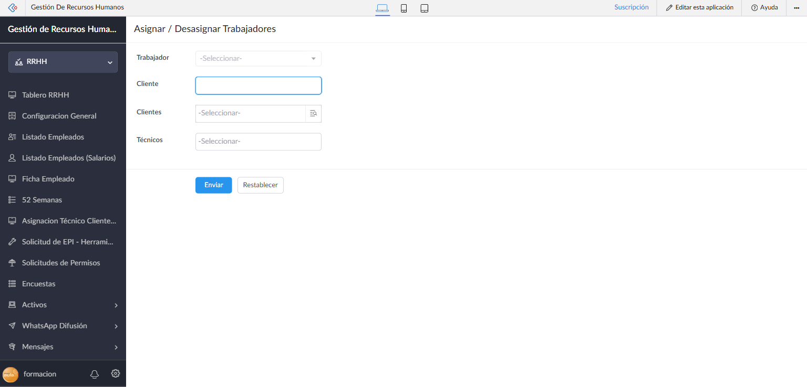

# Módulo D — Administración

**Perfiles:** Administrador, Gestor RRHH, Gestor PRL (según sección)
**Acceso:** [https://creatorapp.zoho.com/formacion11/human-resource-management/](https://creatorapp.zoho.com/formacion11/human-resource-management/) — contexto **RRHH**
**Versión:** 1.0 — Marzo 2026

---

## Índice

1. [Listado de Empleados](#1-listado-de-empleados)
2. [Gestión de Bajas](#2-gestión-de-bajas)
3. [Mapa de Empleados](#3-mapa-de-empleados)
4. [Empresa](#4-empresa)
5. [Usuarios del Sistema](#5-usuarios-del-sistema)
6. [Candidatos Cercanos](#6-candidatos-cercanos)
7. [Encuestas Zoho Survey](#7-encuestas-zoho-survey)
8. [Activos](#8-activos)
   - 8.1 [Tablero Activos](#81-tablero-activos)
   - 8.2 [Activos de Empleados](#82-activos-de-empleados)
   - 8.3 [Historial de Asignaciones de Activos](#83-historial-de-asignaciones-de-activos)
9. [WhatsApp Difusión](#9-whatsapp-difusión)
   - 9.1 [Enviar WhatsApp](#91-enviar-whatsapp)
   - 9.2 [Historial de WhatsApp Enviados](#92-historial-de-whatsapp-enviados)
10. [Asignar / Desasignar Trabajadores](#10-asignar--desasignar-trabajadores)

---

## 1. Listado de Empleados

El **Listado Empleados** es el registro maestro de todos los trabajadores de la empresa. Accede desde el menú lateral: **Listado Empleados** (contexto RRHH).

**Datos mostrados (260 empleados):**

| Columna | Descripción |
|---------|-------------|
| **Código** | Identificador numérico del empleado |
| **Nombre** | Nombre completo (apellidos, nombre) |
| **Encargado RRHH** | Gestor RRHH asignado al empleado |
| **Clientes** | Clientes a los que está actualmente asignado |

### Acciones disponibles

- **Búsqueda Avanzada** — filtra por nombre, área, estado u otros campos
- **Agregar** — crear un nuevo empleado (abre el formulario `Nuevo_Empleado`)
- Click en un registro → abre la **Ficha del Empleado** completa
- **Listado Empleados (Salarios)** — vista complementaria que incluye la columna de salario (acceso restringido según rol)

### Ficha del Empleado

Al hacer clic en un registro, se abre el detalle completo con:
- Datos personales, profesionales y de contacto
- Documentación asignada
- Historial de EPIs, permisos y activos
- Semanas trabajadas

---

## 2. Gestión de Bajas

La sección **Gestión de Bajas** gestiona las altas y bajas programadas de trabajadores. Accede desde: **Gestión de Bajas** en el menú RRHH.

**Columnas de la tabla:**

| Columna | Descripción |
|---------|-------------|
| **Trabajador** | Nombre del empleado a dar de baja |
| **Requerimientos** | Acciones requeridas antes de la baja |
| **Fecha Programada** | Fecha en que se efectuará la baja |
| **Nota** | Comentario adicional sobre la baja |

### Proceso de baja

1. Crear un nuevo registro con el botón **Agregar**.
2. Seleccionar el trabajador y la fecha programada.
3. Indicar los requerimientos previos (entrega de activos, documentación final, etc.).
4. Una vez completada la baja, el trabajador pasa a estado inactivo en el sistema.

> **Nota:** Las bajas no eliminan el historial del empleado; simplemente cambian su estado a inactivo.

---

## 3. Mapa de Empleados

El **Mapa de Empleados** muestra la distribución geográfica del personal en un mapa interactivo basado en OpenStreetMap.

Cada punto en el mapa representa la dirección registrada de un empleado. El mapa está centrado por defecto en la zona de Catalunya/Barcelona, donde se concentra la mayoría del personal.

### Uso

- Desplázate y amplía el mapa para ver zonas concretas.
- Haz clic en un punto para ver el nombre del empleado asociado.
- Útil para planificar asignaciones por proximidad geográfica a los clientes.

---

## 4. Empresa

La sección **Empresa** almacena la información corporativa de la empresa. Contiene un único registro con los datos de DOMO21.

**Campos disponibles:**

| Campo | Valor de ejemplo |
|-------|-----------------|
| **Nombre** | DOMO21 |
| **Teléfono** | +34666604753 |
| **Dirección** | — |
| **CIF/NIF** | — |
| **Email corporativo** | — |
| **Logo** | Imagen de la empresa |

Haz clic en **Editar** para actualizar los datos corporativos. Esta información se usa en plantillas de documentos, correos y comunicaciones automáticas.

---

## 5. Usuarios del Sistema

La sección **Usuarios** gestiona las cuentas de acceso al sistema. Accede desde el final del menú RRHH: **Usuarios**.

**Columnas (15 usuarios activos):**

| Columna | Descripción |
|---------|-------------|
| **User Email** | Email Zoho con el que accede al sistema |
| **Rol** | Rol asignado en la aplicación |
| **Nombre** | Nombre del usuario |
| **WhatsApp para notificaciones** | Número de teléfono para notificaciones |
| **Registro de Empleado** | Empleado vinculado a este usuario |
| **Email para notificaciones** | Email secundario para notificaciones del sistema |

**Roles disponibles:**

| Rol | Descripción |
|-----|-------------|
| **Administrador** | Acceso total a todas las secciones |
| **Gestor RRHH** | Gestión de empleados, permisos, EPIs y mensajes |
| **Gestor PRL** | Gestión de documentación CAE y clientes |
| **Empleado** | Acceso al portal del empleado |

### Crear un usuario

1. Haz clic en **Agregar** (botón azul `+` arriba a la derecha).
2. Introduce el email Zoho de la persona.
3. Selecciona el rol.
4. Vincula el registro de empleado correspondiente.
5. Introduce el WhatsApp y el email para notificaciones.

> **Importante:** El email debe ser una cuenta Zoho válida. Si la persona no tiene cuenta Zoho, recibirá una invitación para crear una.

---

## 6. Candidatos Cercanos

**Candidatos Cercanos** es una herramienta de búsqueda geográfica que localiza candidatos en Zoho Recruit cercanos a un código postal de referencia.

**Campos del buscador:**

| Campo | Descripción | Valor por defecto |
|-------|-------------|-------------------|
| **Código Postal de referencia** | CP desde el que calcular la distancia | 08001 (Barcelona) |
| **Radio (km)** | Radio de búsqueda en kilómetros | 30 |

### Cómo usar

1. Introduce el código postal de la empresa o del cliente.
2. Ajusta el radio de búsqueda según necesidades.
3. Pulsa el botón **🔍 Buscar**.
4. El sistema analiza hasta 200 candidatos en Zoho Recruit y devuelve los que están dentro del radio.

**Resultados (columnas):**

| Columna | Descripción |
|---------|-------------|
| **Nombre** | Nombre completo del candidato |
| **Cargo** | Puesto actual o título en Zoho Recruit |
| **Ciudad** | Ciudad detectada a partir de su CP |
| **Dist.** | Distancia en km al CP de referencia |
| **Teléfono** | Teléfono de contacto (enlace directo) |

> **Nota:** La búsqueda usa un mapa hardcodeado de capitales de provincia y ciudades españolas para evitar llamadas a APIs externas. Los resultados son aproximados (distancia a la capital de provincia).

---

## 7. Encuestas Zoho Survey

La sección **Encuestas** permite gestionar encuestas creadas en **Zoho Survey** y vincularlas al portal del empleado. Los empleados ven las encuestas activas en su portal y pueden responderlas.

**Columnas del listado:**

| Columna | Descripción |
|---------|-------------|
| **Nombre de la Encuesta** | Título descriptivo de la encuesta |
| **Enlace a la encuesta** | URL directa en Zoho Survey |
| **Estado de Encuesta** | Activa / Inactiva |
| **Activar / Desactivar** | Botón para cambiar el estado |

### Crear una encuesta

1. Crea la encuesta en **Zoho Survey** (acceso externo).
2. Copia el enlace público de la encuesta.
3. En esta sección, haz clic en **Agregar** (botón `+`).
4. Introduce el nombre y el enlace.
5. Activa la encuesta con el botón **Activar / Desactivar**.

**Botones de acceso rápido:**

| Botón | Acción |
|-------|--------|
| **Crear Encuesta** | Abre Zoho Survey para crear una nueva encuesta |
| **Ver Respuestas** | Accede al panel de respuestas en Zoho Survey |

> **Consejo:** Solo las encuestas con estado **Activa** aparecen en el portal del empleado. Usa **Activar / Desactivar** para controlar la visibilidad.

---

## 8. Activos

El grupo **Activos** gestiona todos los equipos y bienes asignados a los empleados: ordenadores, teléfonos, vehículos, herramientas y EPIs de inventario.

### 8.1 Tablero Activos

El **Tablero Activos** ofrece una visión ejecutiva del estado del inventario y las asignaciones.

**KPIs superiores:**

| KPI | Valor | Significado |
|-----|-------|-------------|
| **Tipos de Activos** | 8 | Categorías distintas de activos registrados |
| **Unidades en Baja** | 0 | Activos dados de baja |
| **Confirmaciones Pendientes** | 66 | Asignaciones sin confirmación del empleado |

**Panel Activos Generales:**

| Indicador | Valor |
|-----------|-------|
| Total Unidades | 106 |
| Disponibles | 40 |
| En Baja | 0 |
| Disponibilidad | 37% |

Botones: **Ver Activos** → listado completo | **+ Nuevo** → crear activo | **Asignar** → asignar a empleado

**Panel EPI / Ropa / Herramientas:**

| Indicador | Valor |
|-----------|-------|
| Tipos por categoría | EPI:1 \| Ropa:2 \| H:2 |
| Disponibles | 6 |
| En Baja | 0 |
| Disponibilidad | 75% |

Botones: **Inventario** → ver stock EPI | **+ Nuevo EPI** → añadir | **Asignar EPI** → asignar a empleado

**Tabla Últimas Asignaciones:**

La parte inferior muestra las últimas asignaciones realizadas con columnas: Empleado, Activo, Estado (Desasignado / Sin Confirmar / Activo), Fecha.

---

### 8.2 Activos de Empleados

Accede desde: **Activos → Activos de Empleados** (`#Report:Employee_Assets`).

Lista todos los activos actualmente asignados a empleados, con sus estados y fechas de asignación. Permite gestionar confirmaciones pendientes y registrar devoluciones.

**Estados de asignación:**

- **Sin Confirmar** — el empleado aún no ha confirmado la recepción
- **Activo** — asignación activa y confirmada
- **Desasignado** — el activo fue devuelto

---

### 8.3 Historial de Asignaciones de Activos

Accede desde: **Activos → Historial de Asignaciones de Activos** (`#Report:Historial_Asignaciones_Activos`).

Registro completo de todos los movimientos de activos (asignaciones y desasignaciones) con fecha y empleado implicado. Útil para auditorías y control de material.

---

## 9. WhatsApp Difusión

El grupo **WhatsApp Difusión** permite enviar mensajes masivos a trabajadores a través de WhatsApp Business usando la integración de Zoho con el canal `Zoho_PRL`.

### 9.1 Enviar WhatsApp

Accede desde: **WhatsApp Difusión → Enviar WhatsApp** (`#Form:WhatsApp`).

**Campos del formulario:**

| Campo | Obligatorio | Descripción |
|-------|:-----------:|-------------|
| **Plantilla de Mensaje** | ✓ | Selecciona la plantilla aprobada por WhatsApp Business |
| **Enviar a** | ✓ | Todos los trabajadores / Solo trabajadores seleccionados |
| **Trabajadores** | Cond. | Lista de trabajadores destino (si "Solo seleccionados") |
| **Otros Contactos** | — | Números adicionales fuera del sistema |
| **Programar para fecha** | — | Si se activa, permite programar el envío |
| **Fecha y Hora** | Cond. | Fecha/hora de envío programado |
| **Texto del comunicado** | ✓ | Contenido del mensaje (se inserta en la plantilla) |

**Plantillas disponibles:**

| Plantilla | Uso |
|-----------|-----|
| **Comunicado RRHH** | Comunicados generales a trabajadores |
| **Envío de documentación** | Aviso de envío de documentos al cliente |

> **Importante:** Solo se pueden usar plantillas aprobadas por Meta/WhatsApp Business. No es posible enviar mensajes con texto libre sin plantilla.

---

### 9.2 Historial de WhatsApp Enviados

Accede desde: **WhatsApp Difusión → Historial de WhatsApp Enviados** (`#Report:WhatsApp_a_Trabajadores_Report`).

Registro completo de todos los mensajes WhatsApp enviados (27 registros a marzo 2026).

**Columnas:**

| Columna | Descripción |
|---------|-------------|
| **Mensaje** | Texto completo del mensaje (expandible con "Mostrar más") |
| **Enviar a** | Todos / Solo trabajadores seleccionados |
| **Plantilla de Mensaje** | Plantilla utilizada |
| **Programar** | SI si fue un envío programado |
| **Fecha y Hora** | Momento del envío |
| **Cuenta** | Canal WhatsApp usado (`Zoho_PRL`) |
| **Otros Contactos** | Contactos externos incluidos en el envío |

---

## 10. Asignar / Desasignar Trabajadores

El grupo **Asignar / Desasignar Trabajadores** permite gestionar las asignaciones de técnicos a clientes de forma centralizada.

### Formulario de Asignación

Accede desde: **Asignar / Desasignar Trabajadores → Asignar / Desasignar Trabajadores** (`#Form:Asignar_Desasignar_Trabajadores`).

**Campos del formulario:**

| Campo | Descripción |
|-------|-------------|
| **Trabajador** | Técnico a asignar o desasignar (selector desplegable) |
| **Cliente** | Búsqueda libre del cliente |
| **Clientes** | Selección múltiple de clientes (con búsqueda avanzada) |
| **Técnicos** | Campo adicional para selección múltiple de técnicos |

Pulsa **Enviar** para registrar la asignación. El sistema actualiza automáticamente:
- Los contadores de documentación del cliente
- Las listas de trabajadores asignados al cliente
- Las listas de requisitos documentales

Pulsa **Restablecer** para limpiar el formulario sin guardar.

### Reporte de Asignaciones

Accede desde: **Asignar / Desasignar Trabajadores → Asignar / Desasignar Trabajadores Report** (`#Report:Asignar_Desasignar_Trabajadores_Report`).

Vista tabular de todas las asignaciones activas, con opciones de filtrado por trabajador o cliente. Permite ver qué técnicos están asignados a qué clientes en un momento dado.

> **Nota:** Para una vista visual más completa de las asignaciones, usa el **Panel de Asignaciones** (Módulo B — Panel RRHH, sección Dashboards y Analíticas).

---

## Resumen de funcionalidades

| Sección | Perfil | Qué puedes hacer |
|---------|--------|-----------------|
| Listado Empleados | Admin, Gestor RRHH | Ver, buscar y crear empleados |
| Listado Empleados (Salarios) | Admin, Gestor RRHH | Ver nóminas y salarios |
| Gestión de Bajas | Admin, Gestor RRHH | Registrar y programar bajas |
| Mapa Empleados | Admin, Gestor RRHH | Ver distribución geográfica del personal |
| Empresa | Admin | Editar datos corporativos |
| Usuarios | Admin | Gestionar cuentas de acceso y roles |
| Candidatos Cercanos | Admin, Gestor RRHH | Buscar candidatos en Zoho Recruit por proximidad |
| Encuestas Zoho Survey | Admin, Gestor RRHH | Gestionar encuestas para empleados |
| Tablero Activos | Admin, Gestor RRHH | Dashboard de inventario de activos |
| Activos de Empleados | Admin, Gestor RRHH | Listar y gestionar activos asignados |
| Historial Activos | Admin, Gestor RRHH | Auditar movimientos de activos |
| Enviar WhatsApp | Admin, Gestor RRHH | Enviar comunicados masivos por WhatsApp |
| Historial WhatsApp | Admin, Gestor RRHH | Ver historial de mensajes enviados |
| Asignar/Desasignar | Admin, Gestor RRHH, Gestor PRL | Gestionar asignaciones técnico-cliente |

---

*Manual generado el 26/03/2026 — Gestión de Recursos Humanos v2026*
