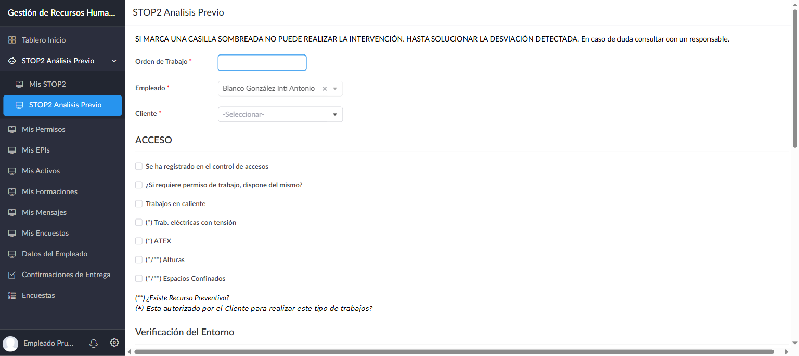
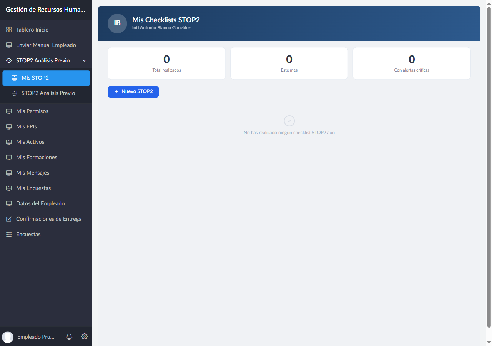

# Manual STOP2 — Guía del Técnico

**Perfil:** Usuario Trabajador (Técnico)
**Acceso:** [https://domo21.zohocreatorportal.com](https://domo21.zohocreatorportal.com) — Portal del Empleado
**Versión:** 1.0 — Julio 2026

---

## Índice

1. [Qué es STOP2](#1-qué-es-stop2)
2. [Cuándo rellenarlo](#2-cuándo-rellenarlo)
3. [Cómo acceder](#3-cómo-acceder)
4. [Datos de identificación](#4-datos-de-identificación)
5. [Las 5 secciones del checklist](#5-las-5-secciones-del-checklist)
6. [Ítems invalidantes: medida de solución y foto de evidencia](#6-ítems-invalidantes-medida-de-solución-y-foto-de-evidencia)
7. [Firma del trabajador](#7-firma-del-trabajador)
8. [Enviar el checklist](#8-enviar-el-checklist)
9. [Consultar tus STOP2 anteriores](#9-consultar-tus-stop2-anteriores)

---

## 1. Qué es STOP2

**STOP2** (Seguridad en el Trabajo: Observación y Prevención) es el análisis de seguridad que debes completar **antes de comenzar cualquier intervención** en las instalaciones de un cliente. Es un checklist de 21 puntos organizado en 5 bloques que verifica que las condiciones de acceso, entorno, tu equipación personal, los materiales y equipos, y el cierre de la intervención cumplen los requisitos mínimos de seguridad.

No es un trámite opcional: algunos ítems del checklist son **invalidantes** — si los marcas en la condición de riesgo, el sistema no te deja avanzar hasta que indiques cómo has resuelto la situación.

## 2. Cuándo rellenarlo

Rellena un STOP2 **por cada orden de trabajo**, antes de empezar la intervención en el cliente. Si en una misma jornada intervienes en varios clientes o realizas varias órdenes de trabajo distintas, necesitas un checklist independiente por cada una.

## 3. Cómo acceder

1. Entra en el Portal del Empleado.
2. En el menú lateral, haz clic en **STOP2 Análisis Previo** para desplegar sus dos opciones.
3. Selecciona **Nuevo STOP2** (segunda opción) para abrir el formulario en blanco.

## 4. Datos de identificación

| Campo | Obligatorio | Descripción |
|-------|:-----------:|-------------|
| **Orden de Trabajo** | ✓ | Número o referencia de la orden de trabajo que vas a ejecutar |
| **Empleado** | — | Se rellena automáticamente con tu nombre, no lo edites |
| **Cliente** | ✓ | Cliente en cuyas instalaciones vas a intervenir |
| **Ubicación** | ✓ | Zona o punto concreto dentro de las instalaciones del cliente |

## 5. Las 5 secciones del checklist

Cada sección tiene sus propios ítems de tipo Sí/No. Los ítems marcados con **(Inv.)** en su etiqueta son **invalidantes**: si los marcas en la condición de riesgo, bloquean el avance (ver §6).

### Acceso
- Registro en el control de accesos al entrar
- Disponibilidad de permiso de trabajo, si la tarea lo requiere — si respondes que **no dispones** del permiso necesario, se te pedirá subir una **foto del permiso** como evidencia de que sí lo tienes
- Trabajos en caliente, eléctricos con tensión **(Inv.)**, ATEX **(Inv.)**, en altura **(Inv.)** o en espacios confinados **(Inv.)** — estos requieren autorización expresa del cliente y, si procede, la presencia de un Recurso Preventivo

### Verificación del Entorno
- Zona en obra **(Inv.)** — si se marca, pide Medida Tomada + Foto de evidencia
- Proximidad a tráfico de vehículos con riesgo de atropello **(Inv.)** — si se marca, pide Medida Tomada + Foto de evidencia
- Señalización y balizamiento de la zona de trabajo
- Condiciones meteorológicas adversas si el equipo está a la intemperie **(Inv.)** — si se marca, pide Medida Tomada + Foto de evidencia

### Verificación Personal
- EPIs disponibles y adecuados para la tarea
- Herramientas en buen estado — si respondes que **no**, se te pedirá subir una **foto de la herramienta en mal estado**
- Medios auxiliares en buen estado

### Verificación de Materiales y Equipos
- Accesibilidad segura para la reparación
- Necesidad de limpieza previa **(Inv.)** — si se marca, pide Medida Tomada + Foto de evidencia
- Material disponible para prevenir riesgos (sobresfuerzos, caídas, etc.)
- Posibilidad de consignar, señalizar y bloquear el equipo

### Verificación Final
- Protecciones retiradas vueltas a colocar en su lugar
- Equipo dejado consignado con candado amarillo y señalizado, si no queda operativo
- Registro de salida en el control de accesos

**Observaciones:** campo de texto libre al final del formulario para cualquier anotación relevante que no encaje en los ítems anteriores.

## 6. Ítems invalidantes: medida de solución y foto de evidencia

> ⚠️ **Importante:** si marcas cualquier ítem señalado como **(Inv.)** en su condición de riesgo, **no podrás enviar el checklist** hasta indicar cómo se ha resuelto la situación.

Al marcar un ítem invalidante, el formulario despliega automáticamente dos campos adicionales para ese ítem concreto:

| Campo nuevo | Qué debes hacer |
|-------------|------------------|
| **Medida tomada / Solución** | Describe brevemente qué medida adoptaste para poder continuar con seguridad (ej. "Se colocó señalización adicional y se acordonó la zona con el responsable de planta") |
| **Foto de evidencia** | Sube una foto que demuestre que la medida se aplicó (la señalización colocada, el EPI adicional usado, la autorización firmada, etc.) |

No puedes dejar el checklist a medias con un invalidante sin resolver: el sistema **bloquea de verdad el envío** (no es solo un aviso) y te indica exactamente qué ítem falta por resolver hasta que rellenes ambos campos. Si en algún momento la situación de riesgo no tiene solución posible en el momento, **detén la intervención y consulta con un responsable** — no fuerces el envío del checklist para "saltarte" el bloqueo.

## 7. Firma del trabajador

Al final del formulario, firma con el dedo o el ratón en el recuadro de **Firma Trabajador**. La firma queda guardada junto con el resto del registro como confirmación de que has realizado tú el análisis.

## 8. Enviar el checklist

Pulsa **Submit**. El sistema calcula automáticamente si la intervención queda **validada**:

- Si todos los ítems están correctos (y, en su caso, los invalidantes tienen medida + foto), el checklist queda como **intervención válida**.
- Si falta algún ítem por marcar o hay un invalidante sin resolver, el sistema no te deja completar el envío — revisa el aviso en pantalla y complétalo.

Tras el envío, el registro aparece automáticamente en tu listado **Mis STOP2** y se incluye en el informe semanal que el sistema envía al cliente los lunes.

## 9. Consultar tus STOP2 anteriores

**Ruta de menú:** STOP2 Análisis Previo → Mis STOP2

Verás un resumen con:
- **Total realizados** — número de checklists completados
- **Este mes** — checklists de este mes
- **Con alertas críticas** — checklists en los que marcaste algún ítem invalidante

Pulsa sobre cualquier registro para ver el detalle completo de lo que rellenaste.

---

*Manual STOP2 (Técnico) actualizado el 20/07/2026 — Gestión de Recursos Humanos v2026*
