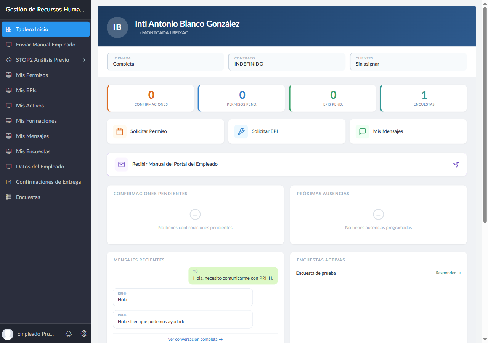
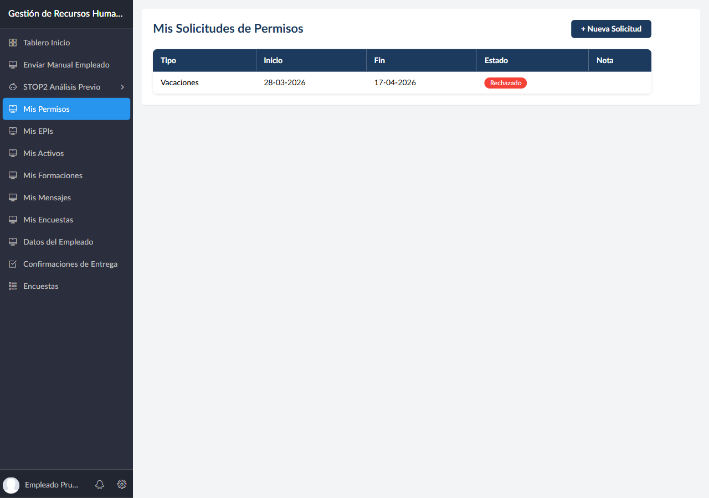
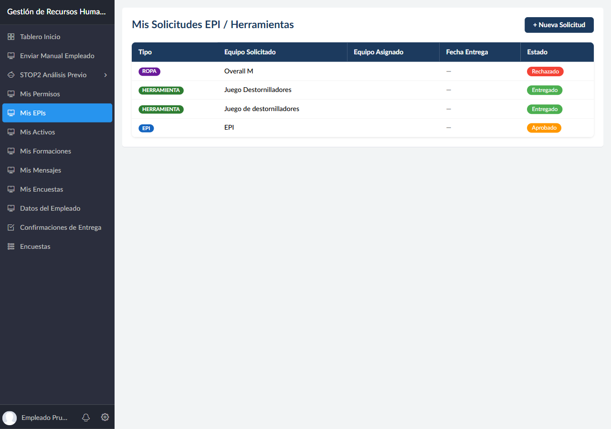
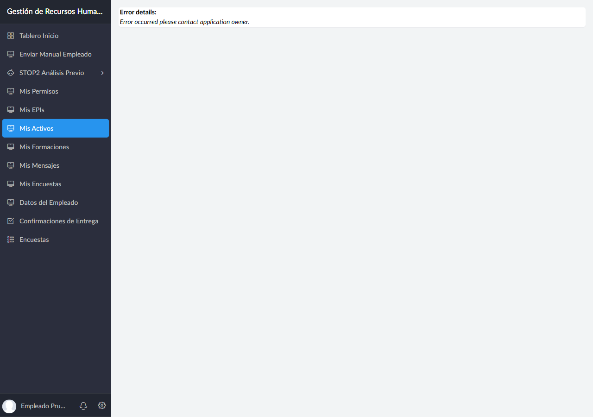
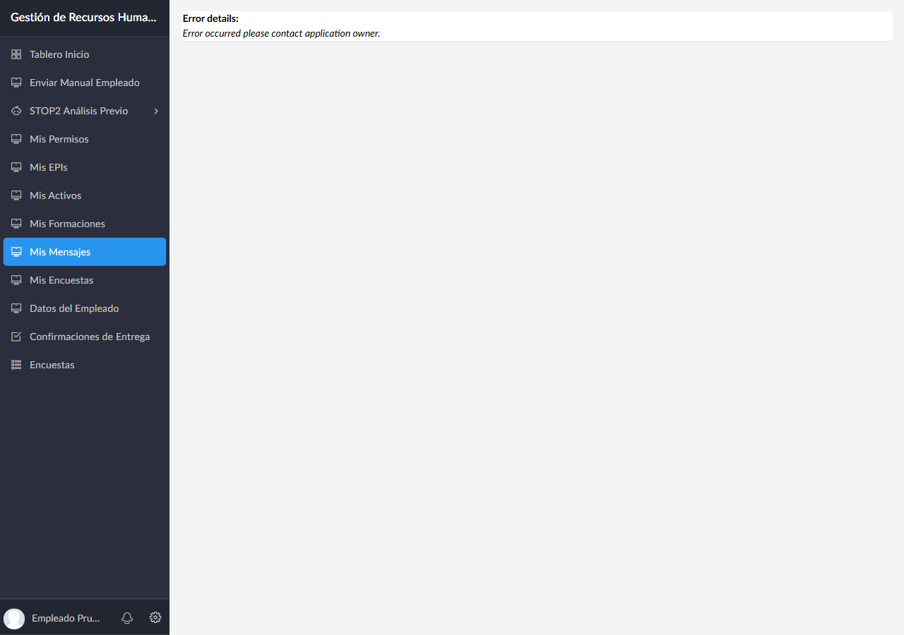
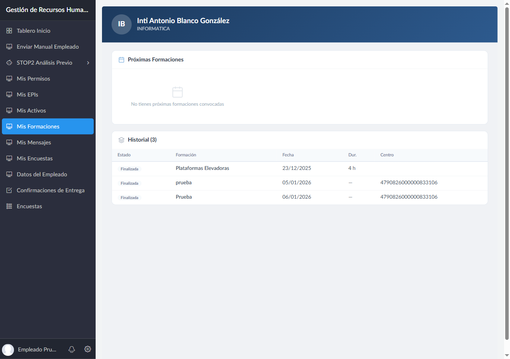
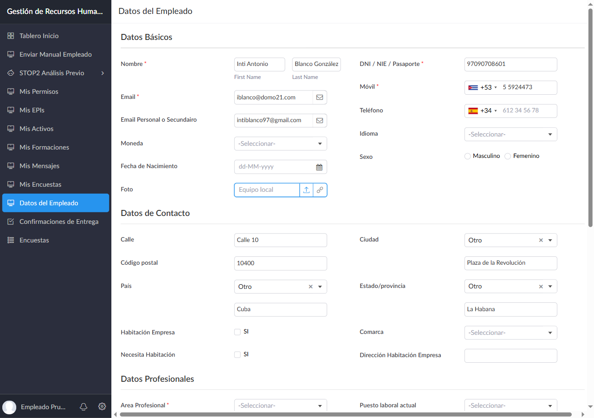
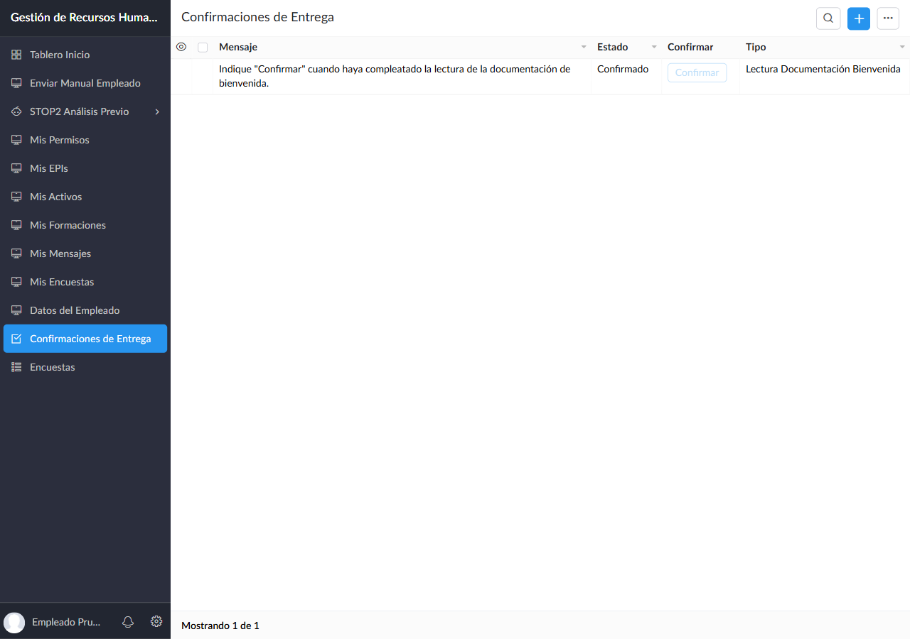
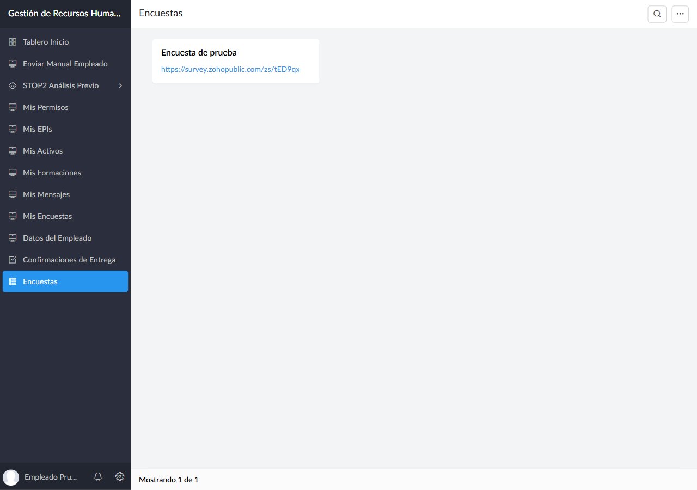

# Manual del Portal del Empleado

**Aplicacion:** Gestion de Recursos Humanos — DOMO21 / Sicma21
**Para:** Trabajadores de la empresa
**Version:** 1.1 — Mayo 2026

---

## Bienvenido al Portal del Empleado

Este manual te guia paso a paso por todas las funciones disponibles en tu portal. Desde aqui puedes solicitar vacaciones, pedir equipos de trabajo, registrar tu analisis de seguridad previo a una intervencion, comunicarte con RRHH y mucho mas.

**Tu acceso:**

> **[https://domo21.zohocreatorportal.com](https://domo21.zohocreatorportal.com)**
>
> Introduce tu email corporativo y tu contrasena de Zoho. Si es tu primer acceso, recibiras un correo para crear o vincular tu cuenta.

---

## Indice

1. [Tablero de Inicio](#1-tablero-de-inicio)
2. [STOP2 — Analisis Previo a una Intervencion](#2-stop2--analisis-previo-a-una-intervencion)
   - 2.1 [Mis STOP2](#21-mis-stop2)
   - 2.2 [Rellenar un nuevo STOP2](#22-rellenar-un-nuevo-stop2)
3. [Solicitar Vacaciones o Permisos](#3-solicitar-vacaciones-o-permisos)
4. [EPIs, Ropa de Trabajo y Herramientas](#4-epis-ropa-de-trabajo-y-herramientas)
5. [Mis Activos](#5-mis-activos)
6. [Mensajes con RRHH](#6-mensajes-con-rrhh)
7. [Mis Formaciones](#7-mis-formaciones)
8. [Mis Datos Personales](#8-mis-datos-personales)
9. [Confirmaciones de Entrega](#9-confirmaciones-de-entrega)
10. [Encuestas](#10-encuestas)
11. [Preguntas Frecuentes](#11-preguntas-frecuentes)

---

## 1. Tablero de Inicio

El Tablero de Inicio es lo primero que ves al entrar en el portal. Te muestra un resumen de tu situacion actual.

### Cabecera

En la parte superior aparece tu nombre completo, tu area profesional y tu localidad.
Debajo, tres datos: tu puesto, el tipo de contrato y los clientes a los que estas asignado.

### Indicadores de pendientes

Una fila de botones clicables te muestra de un vistazo cuantas cosas tienes pendientes:

| Indicador | Que muestra | Al hacer clic |
|-----------|-------------|---------------|
| **Confirmaciones** | Tareas de confirmacion pendientes | Te lleva a Confirmaciones de Entrega |
| **Permisos Pend.** | Solicitudes de permiso sin respuesta | Te lleva a tu listado de permisos |
| **EPIs Pend.** | Solicitudes de EPI/herramienta sin respuesta | Te lleva a tu listado de EPIs |
| **Encuestas** | Encuestas activas pendientes | Te lleva a Encuestas |

Junto a estos indicadores, tres accesos rapidos: **Solicitar Permiso**, **Solicitar EPI** y **Mis Mensajes**.

### Paneles del tablero

| Panel | Que muestra |
|-------|-------------|
| **Confirmaciones Pendientes** | Tareas que RRHH te ha asignado para confirmar |
| **Proximas Ausencias** | Permisos aprobados proximos a comenzar |
| **Mensajes Recientes** | Los ultimos mensajes del chat con RRHH |
| **Encuestas Activas** | Encuestas disponibles con boton para responder |
| **Anuncios** | Comunicados de la empresa (si los hay) |
| **Documentacion con Clientes** | Resumen de tu documentacion requerida por los clientes: cuantos documentos estan al dia, caducados y pendientes |

> Si algun panel aparece vacio, no tienes pendientes en ese apartado. Todo esta en orden.

---

## 2. STOP2 — Analisis Previo a una Intervencion

**STOP2** (Seguridad en el Trabajo: Observacion y Prevencion) es el checklist de seguridad que debes rellenar **antes de comenzar cualquier intervencion** en las instalaciones de un cliente.

Haz clic en **STOP2 Analisis Previo** en el menu lateral para ver sus dos opciones.

### 2.1 Mis STOP2

Esta pantalla muestra un resumen de todos los checklists STOP2 que has realizado.

**Indicadores superiores:**

| Indicador | Que muestra |
|-----------|-------------|
| **Total realizados** | Cuantos checklists has completado en total |
| **Este mes** | Cuantos has completado este mes |
| **Con alertas criticas** | Cuantos tuvieron algun punto bloqueante |

Si no has realizado ninguno aun, aparece el mensaje *"No has realizado ningun checklist STOP2 aun"*.

Para iniciar uno nuevo, pulsa el boton **Nuevo STOP2**.

### 2.2 Rellenar un nuevo STOP2

Antes de ir a trabajar a un cliente, ve a **STOP2 Analisis Previo → STOP2 Analisis Previo** en el menu lateral, o pulsa **Nuevo STOP2** desde la pantalla anterior.

> **Importante:** Si marcas alguna casilla sombreada, **no puedes realizar la intervencion** hasta resolver el problema detectado. En caso de duda, consulta con tu responsable antes de continuar.

**Datos de identificacion:**

| Campo | Descripcion |
|-------|-------------|
| **Orden de Trabajo** | Numero o referencia de la orden de trabajo |
| **Empleado** | Se rellena automaticamente con tu nombre |
| **Cliente** | El cliente en cuyas instalaciones vas a intervenir |

**Secciones del checklist:**

El formulario esta dividido en cinco bloques de verificacion. Marca cada casilla que aplique a tu situacion:

#### Acceso
Verificacion de permisos y condiciones de entrada:
- Registro en el control de accesos
- Disponibilidad del permiso de trabajo (si lo necesitas)
- Si el trabajo implica riesgo especial (trabajos en caliente, electricos con tension, en altura, espacios confinados, ATEX), debes tener autorizacion expresa del cliente

#### Verificacion del Entorno
Estado del area donde vas a trabajar:
- Zona en obra o con trafico de vehiculos
- Senalizacion y balizamiento de la zona de trabajo
- Condiciones meteorologicas adversas (lluvia, nieve)

#### Verificacion Personal
Tu estado antes de comenzar:
- Tienes todos los EPIs necesarios
- Herramientas y medios auxiliares en buen estado
- Si trabajas en solitario, has coordinado revisiones periodicas con el cliente

#### Verificacion de Materiales y Equipos
Estado del equipo a intervenir:
- Acceso seguro al equipo
- Material disponible para prevenir riesgos
- El equipo puede consignarse (y se consigna) correctamente

#### Verificacion Final
Comprobaciones al terminar:
- Las protecciones retiradas se han vuelto a colocar
- Si el equipo no queda operativo, esta consignado con candado amarillo y senalizado
- Te has registrado en el control de accesos al salir

**Observaciones:** Campo de texto libre para cualquier anotacion relevante.

Pulsa **Submit** para guardar el analisis. Quedara registrado en tu listado **Mis STOP2**.

---

## 3. Solicitar Vacaciones o Permisos

En el menu lateral, haz clic en **Mis Permisos**.

Veras una tabla con todas tus solicitudes y su estado actual.

**Que significa cada columna:**

| Columna | Descripcion |
|---------|-------------|
| **Tipo** | Vacaciones, Permiso Retribuido o Permiso no Retribuido |
| **Inicio** | Primer dia del permiso |
| **Fin** | Ultimo dia del permiso |
| **Estado** | En que punto esta tu solicitud |
| **Nota** | El comentario que escribiste al solicitarlo |

**Colores del estado:**

| Color | Estado | Que significa |
|-------|--------|---------------|
| Naranja | **Sin Respuesta** | RRHH todavia no ha revisado tu solicitud |
| Verde | **Aprobado** | Tu permiso ha sido aprobado |
| Rojo | **Rechazado** | La solicitud fue denegada |

### Como solicitar un permiso o vacaciones

Pulsa el boton **+ Nueva Solicitud** (arriba a la derecha).

> **Importante:** Las solicitudes deben hacerse con al menos **15 dias de antelacion**.

**Campos a rellenar:**

| Campo | Es obligatorio | Que poner |
|-------|:--------------:|-----------|
| **Tipo** | Si | Elige: Vacaciones / Permiso Retribuido / Permiso no Retribuido |
| **Fecha de comienzo** | Si | Se pre-rellena con hoy + 15 dias. Puedes cambiarla |
| **Fecha de Fin** | Si | Se pre-rellena con unos 7 dias despues. Ajustala segun necesites |
| **Nota** | No | Texto libre para dar contexto (recomendado) |

**Pasos:**

1. Pulsa **+ Nueva Solicitud**
2. Selecciona el **Tipo** de permiso
3. Ajusta las **fechas** de inicio y fin
4. Escribe una **Nota** si quieres explicar el motivo
5. Pulsa **Enviar**

Tu solicitud llegara a RRHH automaticamente. Puedes seguir su estado en **Mis Permisos**.

---

## 4. EPIs, Ropa de Trabajo y Herramientas

En el menu lateral, haz clic en **Mis EPIs**.

Veras una tabla con todos los equipos y herramientas que has solicitado y su estado actual.

**Que significa cada columna:**

| Columna | Descripcion |
|---------|-------------|
| **Tipo** | EPI, ROPA o HERRAMIENTA |
| **Equipo Solicitado** | Lo que pediste |
| **Equipo Asignado** | El equipo concreto que te dieron |
| **Fecha Entrega** | Cuando te lo entregaron |
| **Estado** | En que punto esta la solicitud |

**Colores del estado:**

| Color | Estado | Que significa |
|-------|--------|---------------|
| Verde | **Entregado / Confirmado** | Ya lo tienes y has confirmado la recepcion |
| Naranja | **Aprobado / Gestionandose** | RRHH lo ha aprobado y estan gestionando la entrega |
| Rojo | **Rechazado** | La solicitud fue denegada |
| Gris | **Pendiente** | En espera de que RRHH la revise |

### Como solicitar un EPI o herramienta

Pulsa el boton **+ Nueva Solicitud** (arriba a la derecha).

**Campos a rellenar:**

| Campo | Es obligatorio | Que poner |
|-------|:--------------:|-----------|
| **Tipo de equipo** | Si | Elige: EPI / ROPA / HERRAMIENTA |
| **Equipo Solicitado** | Si | Describe con detalle que necesitas |
| **Motivo** | No | Explica por que lo necesitas (recomendado) |

**Pasos:**

1. Pulsa **+ Nueva Solicitud**
2. Selecciona el **tipo** de equipo
3. Describe **que necesitas** con detalle
4. Explica el **motivo** si es posible
5. Pulsa **Enviar**

Tu solicitud llegara a RRHH. Sigue su estado en **Mis EPIs**.

---

## 5. Mis Activos

En el menu lateral, haz clic en **Mis Activos**.

Esta seccion te muestra los equipos y materiales de la empresa que tienes asignados actualmente.

| Dato | Descripcion |
|------|-------------|
| **Tipo** | Categoria del activo (EPI, ROPA, HERRAMIENTA, etc.) |
| **Elemento** | Nombre del activo asignado |
| **Serie** | Numero de serie del equipo (si aplica) |
| **Unidades** | Cantidad asignada |

> Esta es una vista de solo lectura. Si necesitas solicitar un nuevo equipo, ve a [EPIs, Ropa y Herramientas](#4-epis-ropa-de-trabajo-y-herramientas).

Si la lista aparece vacia, no tienes activos asignados actualmente.

---

## 6. Mensajes con RRHH

En el menu lateral, haz clic en **Mis Mensajes**.

Esta seccion es tu canal de comunicacion directa con el equipo de RRHH. Funciona como un chat.

**Como leer los mensajes:**

- **Burbujas de la derecha** — Son tus mensajes
- **Burbujas de la izquierda** — Son las respuestas de RRHH, con el nombre del gestor que responde
- Cada mensaje tiene su **fecha y hora**

**Para enviar un nuevo mensaje:**

1. Pulsa el boton **Enviar nuevo mensaje** en la parte inferior del chat
2. Se abrira un formulario con un campo de texto
3. Escribe tu consulta
4. Pulsa **Enviar**

> **Consejo:** Usa este canal para cualquier duda sobre tu contrato, nominas, dias de vacaciones disponibles o cualquier tema relacionado con tu situacion laboral.

---

## 7. Mis Formaciones

En el menu lateral, haz clic en **Mis Formaciones**.

Esta seccion muestra las formaciones a las que has sido convocado o en las que has participado.

**Proximas Formaciones:** Cursos y jornadas a los que has sido convocado pero que aun no han tenido lugar. Si no tienes ninguna, aparece el mensaje *"No tienes proximas formaciones convocadas"*.

**Historial:** Tus formaciones ya realizadas.

| Columna | Descripcion |
|---------|-------------|
| **Estado** | Estado de la formacion (ej. Finalizada) |
| **Formacion** | Nombre del curso |
| **Fecha** | Fecha de celebracion |
| **Dur.** | Duracion en horas |
| **Centro** | Centro formativo |

> Si no aparece ninguna formacion, el departamento aun no ha registrado ninguna para ti.

---

## 8. Mis Datos Personales

En el menu lateral, haz clic en **Datos del Empleado**.

Esta seccion te permite consultar y actualizar tu informacion personal y profesional.

### Datos Basicos

| Campo | Descripcion |
|-------|-------------|
| **Nombre y Apellidos** | Tu nombre completo |
| **Email** | Tu email corporativo |
| **Email Personal** | Email alternativo para comunicaciones |
| **Fecha de Nacimiento** | Tu fecha de nacimiento |
| **Foto** | Tu foto de perfil |
| **DNI / NIE / Pasaporte** | Tu documento de identidad |
| **Movil** | Tu telefono movil con prefijo |
| **Idioma** | Tu idioma preferido |
| **Sexo** | Masculino / Femenino |

### Datos de Contacto

Tu direccion completa: calle, codigo postal, pais, ciudad, provincia y comarca. Tambien puedes indicar si dispones de habitacion de empresa o si la necesitas.

### Datos Profesionales

Tu area de trabajo, profesion, categoria profesional, puesto y especialidad.

### Regimen y otra informacion

Tipo de regimen laboral (General / Autonomo) y si dispones de carnet de conducir o vehiculo propio.

### Documentacion de bienvenida

Al final del formulario veras el campo **Leida Documentacion Bienvenida** (SI / NO). Marcalo como **SI** cuando hayas leido el documento de bienvenida de la empresa.

> **Para guardar cualquier cambio:** Pulsa **Enviar** en la parte inferior del formulario.

---

## 9. Confirmaciones de Entrega

En el menu lateral, haz clic en **Confirmaciones de Entrega**.

Aqui veras las tareas de confirmacion que RRHH te ha asignado. Cada tarea requiere que confirmes que has recibido o leido algo.

**Columnas:**

| Columna | Descripcion |
|---------|-------------|
| **Mensaje** | Lo que debes confirmar |
| **Estado** | Pendiente o Confirmado |
| **Confirmar** | Enlace para marcar como confirmado |
| **Tipo** | Categoria de la confirmacion |

**Como confirmar:**

1. Lee el mensaje de la tarea
2. Realiza la accion indicada (por ejemplo, lee el documento de bienvenida)
3. Pulsa el enlace **Confirmar**
4. El estado cambiara a **Confirmado**

> **Atencion:** Una vez confirmado, no se puede deshacer. Confirma solo cuando hayas completado la tarea.

---

## 10. Encuestas

En el menu lateral, haz clic en **Encuestas**.

Aqui encontraras las encuestas que la empresa ha preparado para ti.

Cada encuesta aparece como una tarjeta con su nombre y un enlace para acceder a ella.

**Como participar:**

1. Haz clic en el enlace de la encuesta
2. Se abrira en una nueva pestana
3. Completa la encuesta y enviala

> El numero de encuestas pendientes tambien aparece como indicador en tu Tablero de Inicio.

---

## 11. Preguntas Frecuentes

### No puedo entrar al portal

- Asegurate de usar tu **email corporativo** (no el personal)
- Si es tu primera vez, busca en tu correo un mensaje de Zoho para activar la cuenta
- Si olvidaste la contrasena, usa la opcion **"He olvidado mi contrasena"** en la pantalla de login
- Si el problema persiste, contacta con RRHH

### No veo mis clientes en el Tablero

Si la seccion "Documentacion con Clientes" aparece vacia, puede que aun no estes asignado a ningun cliente. Contacta con RRHH si crees que deberia aparecer informacion.

### He pedido un permiso pero sigue en "Sin Respuesta"

Las solicitudes las revisa RRHH manualmente. Dale unos dias habiles. Si ha pasado mas de una semana, envia un mensaje a RRHH desde la seccion [Mensajes](#6-mensajes-con-rrhh).

### Tengo que hacer un STOP2 pero no se como

Ve al menu lateral → **STOP2 Analisis Previo** → **STOP2 Analisis Previo**. Rellena el formulario antes de comenzar la intervencion. Si tienes dudas sobre si debes marcar algun punto, consulta con tu responsable antes de proceder.

### Quiero cambiar mi foto de perfil

Ve a **Datos del Empleado**, busca el campo **Foto**, sube una imagen nueva y pulsa **Enviar** para guardar.

### No me llegan notificaciones de mis solicitudes

Comprueba que en tu perfil de **Datos del Empleado** tienes un email de notificaciones configurado. Si el campo esta vacio, las notificaciones no llegaran; en ese caso, contacta con RRHH para que lo configuren.

### Tengo una duda que no aparece aqui

Usa la seccion [Mensajes con RRHH](#6-mensajes-con-rrhh) para enviar tu consulta. Te responderan por el mismo canal.

---

## Resumen rapido

| Quiero... | Donde ir |
|-----------|----------|
| Ver mi informacion y pendientes | Tablero de Inicio |
| Registrar analisis de seguridad antes de una intervencion | STOP2 Analisis Previo → STOP2 Analisis Previo |
| Ver mis checklists STOP2 anteriores | STOP2 Analisis Previo → Mis STOP2 |
| Pedir vacaciones o un permiso | Mis Permisos → + Nueva Solicitud |
| Ver el estado de mis permisos | Mis Permisos |
| Pedir un EPI, ropa o herramienta | Mis EPIs → + Nueva Solicitud |
| Ver mis equipos solicitados | Mis EPIs |
| Ver mis activos asignados | Mis Activos |
| Ver mis formaciones | Mis Formaciones |
| Enviar un mensaje a RRHH | Mis Mensajes |
| Actualizar mis datos personales | Datos del Empleado |
| Confirmar una tarea de RRHH | Confirmaciones de Entrega |
| Responder una encuesta | Encuestas |

---

**Tu portal:** [https://domo21.zohocreatorportal.com](https://domo21.zohocreatorportal.com)

*Manual del Portal del Empleado — Gestion de Recursos Humanos v2026*
