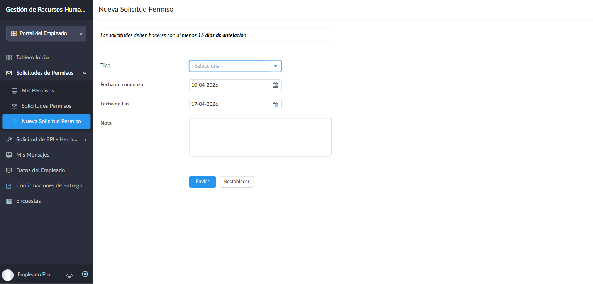
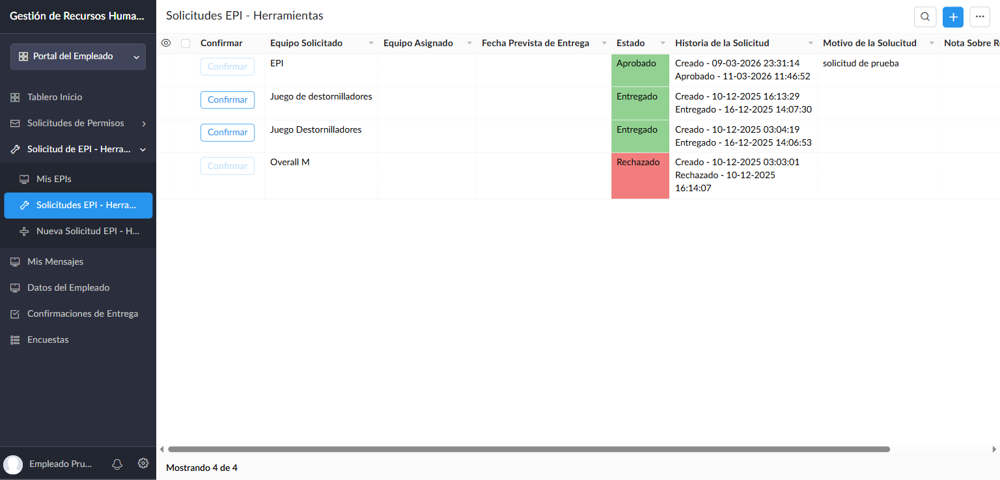
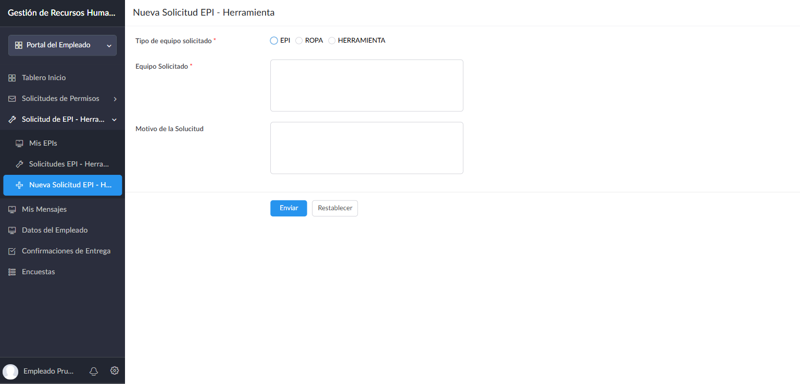

# Manual del Portal del Empleado

**Aplicación:** Gestión de Recursos Humanos — DOMO21 / Sicma21
**Para:** Trabajadores de la empresa
**Versión:** 1.0 — Marzo 2026

---

## Bienvenido al Portal del Empleado

Este manual te guía paso a paso por todas las funciones disponibles en tu portal. Desde aquí puedes solicitar vacaciones, pedir equipos de trabajo, comunicarte con RRHH y mucho más.

**Tu acceso:**

> **[https://domo21.zohocreatorportal.com](https://domo21.zohocreatorportal.com)**
>
> Introduce tu email corporativo y tu contraseña de Zoho. Si es tu primer acceso, recibirás un correo para crear o vincular tu cuenta.

---

## Indice

1. [Tablero de Inicio](#1-tablero-de-inicio)
2. [Solicitar Vacaciones o Permisos](#2-solicitar-vacaciones-o-permisos)
   - 2.1 [Ver mis permisos](#21-ver-mis-permisos)
   - 2.2 [Historial de solicitudes](#22-historial-de-solicitudes)
   - 2.3 [Crear una nueva solicitud](#23-crear-una-nueva-solicitud)
3. [EPIs, Ropa de Trabajo y Herramientas](#3-epis-ropa-de-trabajo-y-herramientas)
   - 3.1 [Ver mis EPIs](#31-ver-mis-epis)
   - 3.2 [Historial y confirmacion de entregas](#32-historial-y-confirmacion-de-entregas)
   - 3.3 [Solicitar un EPI o herramienta](#33-solicitar-un-epi-o-herramienta)
4. [Mis Activos](#4-mis-activos)
5. [Mensajes con RRHH](#5-mensajes-con-rrhh)
6. [Mis Datos Personales](#6-mis-datos-personales)
7. [Confirmaciones de Entrega](#7-confirmaciones-de-entrega)
8. [Encuestas](#8-encuestas)
9. [Preguntas Frecuentes](#9-preguntas-frecuentes)

---

## 1. Tablero de Inicio


El Tablero de Inicio es lo primero que ves al entrar en el portal. Te muestra un resumen de tu situacion actual.

### Tarjetas superiores

En la parte de arriba encontraras cuatro tarjetas con tu informacion:

| Tarjeta | Que muestra |
|---------|-------------|
| **Tu nombre** | Tu nombre completo tal como aparece en el sistema |
| **Area** | Tu area o departamento de trabajo |
| **Clientes** | Los clientes a los que estas asignado actualmente |
| **Encuestas** | Numero de encuestas pendientes de responder (numero verde) |

### Confirmaciones pendientes

Justo debajo veras las **confirmaciones de entrega** que tengas pendientes. Por ejemplo, si RRHH te ha enviado la documentacion de bienvenida, aqui aparecera una tarea para que confirmes que la has leido.

> Si no aparece nada, significa que no tienes confirmaciones pendientes. Todo esta en orden.

### Documentacion con clientes

En la parte inferior se muestra un resumen de la documentacion que los clientes a los que estas asignado necesitan de ti: que documentos estan al dia, cuales faltan por subir y cuales han caducado.

> Si esta seccion aparece vacia, puede que aun no estes asignado a ningun cliente o que no se te haya requerido documentacion todavia.

---

## 2. Solicitar Vacaciones o Permisos

En el menu lateral izquierdo, haz clic en **Solicitudes de Permisos** para ver las tres opciones disponibles: Mis Permisos, Solicitudes Permisos y Nueva Solicitud Permiso.

### 2.1 Ver mis permisos


La pagina **Mis Permisos** te muestra de un vistazo todas tus solicitudes y en que estado estan.

**Que significa cada columna:**

| Columna | Descripcion |
|---------|-------------|
| **Tipo** | Vacaciones, Permiso Retribuido o Permiso no Retribuido |
| **Inicio** | Primer dia del permiso |
| **Fin** | Ultimo dia del permiso |
| **Estado** | En que punto esta tu solicitud (ver abajo) |
| **Nota** | El comentario que escribiste al solicitarlo |

**Colores del estado:**

| Color | Estado | Que significa |
|-------|--------|---------------|
| Naranja | **Sin Respuesta** | RRHH todavia no ha revisado tu solicitud |
| Verde | **Aprobado** | Tu permiso ha sido aprobado |
| Rojo | **Rechazado** | La solicitud fue denegada |

### 2.2 Historial de solicitudes

La opcion **Solicitudes Permisos** del menu te muestra el listado completo de todas tus solicitudes con mas detalle. Puedes usar la **Busqueda Avanzada** para filtrar por fechas o estado.

### 2.3 Crear una nueva solicitud



Haz clic en **Nueva Solicitud Permiso** en el menu lateral, o pulsa el boton **+ Nueva Solicitud** desde cualquier vista de permisos.

> **Importante:** Las solicitudes deben hacerse con al menos **15 dias de antelacion**.

**Campos a rellenar:**

| Campo | Es obligatorio | Que poner |
|-------|:--------------:|-----------|
| **Tipo** | Si | Elige: Vacaciones / Permiso Retribuido / Permiso no Retribuido |
| **Fecha de comienzo** | Si | Se rellena automaticamente con la fecha de hoy + 15 dias. Puedes cambiarla |
| **Fecha de Fin** | Si | Se rellena con unos 7 dias despues. Ajustala segun necesites |
| **Nota** | No | Texto libre para dar contexto (opcional pero recomendado) |

**Pasos:**

1. Selecciona el **Tipo** de permiso
2. Ajusta las **fechas** de inicio y fin
3. Escribe una **Nota** si quieres explicar el motivo
4. Pulsa **Enviar**

Tu solicitud llegara a RRHH automaticamente. Puedes seguir su estado en **Mis Permisos**.

---

## 3. EPIs, Ropa de Trabajo y Herramientas

En el menu lateral, haz clic en **Solicitud de EPI - Herramientas** para ver las opciones: Mis EPIs, Solicitudes EPI - Herramientas y Nueva Solicitud.

### 3.1 Ver mis EPIs


La pagina **Mis EPIs** te muestra todos los equipos y herramientas que has solicitado, con su estado actual.

**Que significa cada columna:**

| Columna | Descripcion |
|---------|-------------|
| **Tipo** | Tipo de equipo con un color distintivo: EPI (azul), ROPA (morado), HERRAMIENTA (verde) |
| **Equipo Solicitado** | Lo que pediste |
| **Equipo Asignado** | El equipo concreto que te dieron (puede ser diferente al solicitado) |
| **Fecha Entrega** | Cuando te lo entregaron |
| **Estado** | En que punto esta (ver abajo) |

**Colores del estado:**

| Color | Estado | Que significa |
|-------|--------|---------------|
| Verde | **Entregado / Confirmado** | Ya lo tienes y has confirmado la recepcion |
| Naranja | **Aprobado / Gestionandose** | RRHH lo ha aprobado y estan gestionando la entrega |
| Rojo | **Rechazado** | La solicitud fue denegada |
| Gris | **Pendiente** | En espera de que RRHH la revise |

### 3.2 Historial y confirmacion de entregas



La opcion **Solicitudes EPI - Herramientas** del menu muestra el listado completo con todo el historial de cada solicitud.

**Columna "Confirmar":**
Cuando te entreguen un equipo fisicamente, pulsa el boton **Confirmar** en esa fila para dejar constancia de que lo recibiste. Una vez confirmado, el boton se desactiva.

**Columna "Historia de la Solicitud":**
Muestra un registro cronologico de cada paso:
```
Creado - 10-12-2025 16:13:29
Entregado - 16-12-2025 14:07:30
```

### 3.3 Solicitar un EPI o herramienta



Haz clic en **Nueva Solicitud EPI - H...** en el menu lateral, o pulsa **+ Nueva Solicitud** desde cualquier vista de EPIs.

**Campos a rellenar:**

| Campo | Es obligatorio | Que poner |
|-------|:--------------:|-----------|
| **Tipo de equipo solicitado** | Si | Elige: EPI / ROPA / HERRAMIENTA |
| **Equipo Solicitado** | Si | Describe con detalle que necesitas |
| **Motivo de la Solicitud** | No | Explica por que lo necesitas (recomendado) |

**Pasos:**

1. Selecciona el **tipo** de equipo
2. Describe en detalle **que necesitas** en "Equipo Solicitado"
3. Explica el **motivo** si es posible (ayuda a que RRHH lo gestione mas rapido)
4. Pulsa **Enviar**

Tu solicitud llegara a RRHH. Sigue su estado en **Mis EPIs**.

---

## 4. Mis Activos

La seccion **Mis Activos** te muestra los activos de la empresa que tienes asignados actualmente (EPIs activos, ropa de trabajo, herramientas, equipos informaticos, etc.).

Cada activo muestra:

| Dato | Descripcion |
|------|-------------|
| **Tipo** | EPI (azul), ROPA (morado) o HERRAMIENTA (verde) |
| **Nombre** | Nombre del activo asignado |
| **Unidades** | Cantidad asignada |
| **N. Serie** | Numero de serie del equipo (si aplica) |
| **Desde** | Fecha en que se te asigno |

> Esta es una vista de solo lectura. Si necesitas solicitar un nuevo equipo, ve a [Solicitar un EPI o herramienta](#33-solicitar-un-epi-o-herramienta).

Si la lista aparece vacia, significa que no tienes activos asignados actualmente.

---

## 5. Mensajes con RRHH


La seccion **Mis Mensajes** es tu canal de comunicacion directa con el equipo de RRHH. Funciona como un chat.

**Como leer los mensajes:**

- **Burbujas verdes (derecha)** — Son tus mensajes
- **Burbujas blancas (izquierda)** — Son las respuestas de RRHH, con el nombre del gestor que responde
- Cada mensaje tiene su **fecha y hora**
- El simbolo **check** confirma que tu mensaje fue recibido

**Para enviar un nuevo mensaje:**

1. Pulsa el boton **Enviar nuevo mensaje** en la parte inferior del chat
2. Se abrira un formulario con un campo de texto
3. Escribe tu consulta o mensaje
4. Pulsa **Enviar**

> **Consejo:** Usa este canal para cualquier duda sobre tu contrato, nominas, dias de vacaciones disponibles, o cualquier tema relacionado con tu situacion laboral. RRHH recibira una notificacion y te respondera por aqui mismo.

---

## 6. Mis Datos Personales


La seccion **Datos del Empleado** te permite consultar y actualizar tu informacion personal y profesional.

El formulario tiene cuatro secciones:

### Datos Basicos

| Campo | Descripcion |
|-------|-------------|
| **Nombre y Apellidos** | Tu nombre completo |
| **Email** | Tu email corporativo (principal) |
| **Email Personal** | Email alternativo para comunicaciones |
| **Fecha de Nacimiento** | Tu fecha de nacimiento |
| **Foto** | Tu foto de perfil (puedes subir una nueva) |
| **DNI / NIE / Pasaporte** | Tu documento de identidad |
| **Movil** | Tu telefono movil con prefijo |
| **Telefono** | Telefono fijo (opcional) |
| **Idioma** | Tu idioma preferido |
| **Sexo** | Masculino / Femenino |

### Datos de Contacto

Tu direccion completa: calle, codigo postal, pais, ciudad, provincia y comarca. Tambien puedes indicar si dispones de **habitacion de empresa** o si la necesitas.

### Datos Profesionales

| Campo | Descripcion |
|-------|-------------|
| **Area Profesional** | Tu area de trabajo (ej: Informatica, Construccion) |
| **Profesion** | Tu profesion |
| **Categoria Profesional** | Tu nivel (ej: Ingeniero, Tecnico) |
| **Puesto laboral actual** | Tu puesto actual |
| **Especialidad** | Tu especialidad dentro de la profesion |
| **Informacion adicional** | Cualquier dato extra relevante |

### Regimen y otra informacion

Tu tipo de regimen laboral (General / Autonomo) y si dispones de carnet de conducir o vehiculo propio.

### Documentacion de bienvenida

Al final del formulario veras el campo **Leida Documentacion Bienvenida** con opciones SI / NO. Marcalo como **SI** cuando hayas leido el documento de bienvenida de la empresa.

> **Para guardar los cambios:** Cuando termines de editar cualquier campo, pulsa **Enviar** en la parte inferior.

---

## 7. Confirmaciones de Entrega


Aqui veras las tareas de confirmacion que RRHH te ha asignado. Cada tarea requiere que confirmes que has recibido o leido algo.

**Columnas:**

| Columna | Descripcion |
|---------|-------------|
| **Mensaje** | Que es lo que debes confirmar |
| **Estado** | Pendiente o Confirmado |
| **Confirmar** | Boton para confirmar |
| **Tipo** | Categoria de la confirmacion |

**Como confirmar:**

1. Lee el mensaje de la tarea
2. Realiza la accion indicada (por ejemplo, lee el documento de bienvenida)
3. Pulsa el boton **Confirmar**
4. El estado cambiara a **Confirmado** y el boton quedara desactivado

> **Atencion:** Una vez confirmado, no se puede deshacer. Confirma solo cuando hayas completado la tarea.

---

## 8. Encuestas


En la seccion **Encuestas** encontraras las encuestas que la empresa ha preparado para ti.

Cada encuesta aparece como una tarjeta con su nombre y un enlace para acceder.

**Como participar:**

1. Ve a **Encuestas** en el menu lateral
2. Haz clic en el enlace de la encuesta
3. Se abrira en una nueva pestana
4. Completa la encuesta y enviala

> El numero de encuestas pendientes tambien aparece como un **numero verde** en tu Tablero de Inicio.

---

## 9. Preguntas Frecuentes

### No puedo entrar al portal

- Asegurate de que usas tu **email corporativo** (no el personal)
- Si es tu primera vez, busca en tu bandeja de entrada un correo de Zoho para activar tu cuenta
- Si olvidaste la contrasena, usa la opcion **"He olvidado mi contrasena"** en la pantalla de login
- Si el problema persiste, contacta con RRHH

### No veo mis clientes en el Tablero

Si la tarjeta "Clientes" aparece vacia, puede que aun no estes asignado a ningun cliente. Contacta con RRHH si crees que deberia aparecer informacion.

### He pedido un permiso pero sigue en "Sin Respuesta"

Las solicitudes las revisa RRHH manualmente. Dale unos dias. Si ha pasado mas de una semana, envia un mensaje a RRHH desde la seccion [Mensajes](#5-mensajes-con-rrhh).

### Me han entregado un equipo pero no se como confirmarlo

Ve a **Solicitudes EPI - Herramientas** en el menu lateral. En la fila del equipo entregado veras un boton **Confirmar**. Pulsalo para registrar que lo recibiste.

### Quiero cambiar mi foto de perfil

Ve a **Datos del Empleado**, busca el campo **Foto**, sube una imagen nueva y pulsa **Enviar** para guardar.

### No me llegan las encuestas

Las encuestas las crea la empresa cuando es necesario. Si no ves ninguna, simplemente no hay encuestas activas en este momento.

### Tengo una duda que no aparece aqui

Usa la seccion [Mensajes con RRHH](#5-mensajes-con-rrhh) para enviar tu consulta directamente al equipo de RRHH. Te responderan por el mismo canal.

---

## Resumen rapido

| Quiero... | Donde ir |
|-----------|----------|
| Ver mi informacion resumida | Tablero de Inicio |
| Pedir vacaciones o un permiso | Solicitudes de Permisos → Nueva Solicitud Permiso |
| Ver el estado de mis permisos | Solicitudes de Permisos → Mis Permisos |
| Pedir un EPI, ropa o herramienta | Solicitud de EPI → Nueva Solicitud |
| Ver mis equipos solicitados | Solicitud de EPI → Mis EPIs |
| Confirmar que recibi un equipo | Solicitud de EPI → Solicitudes EPI → boton Confirmar |
| Ver mis activos asignados | Mis Activos |
| Enviar un mensaje a RRHH | Mensajes → Mis Mensajes |
| Actualizar mis datos personales | Datos del Empleado |
| Confirmar una tarea de RRHH | Confirmaciones de Entrega |
| Responder una encuesta | Encuestas |

---

**Tu portal:** [https://domo21.zohocreatorportal.com](https://domo21.zohocreatorportal.com)

*Manual del Portal del Empleado — Gestion de Recursos Humanos v2026*
